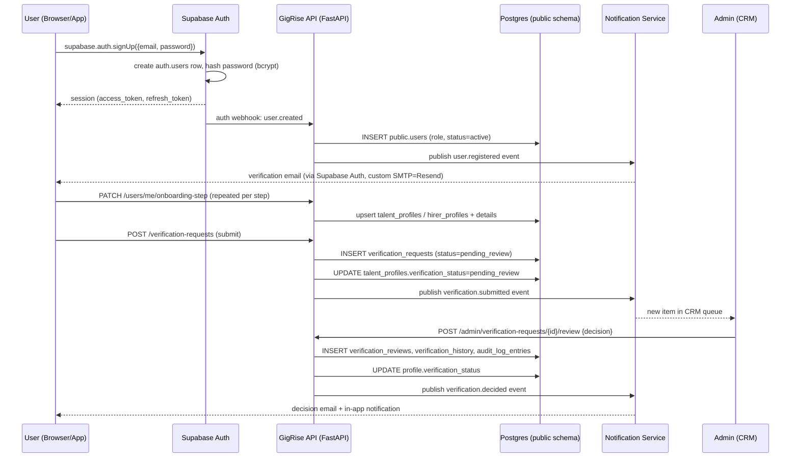
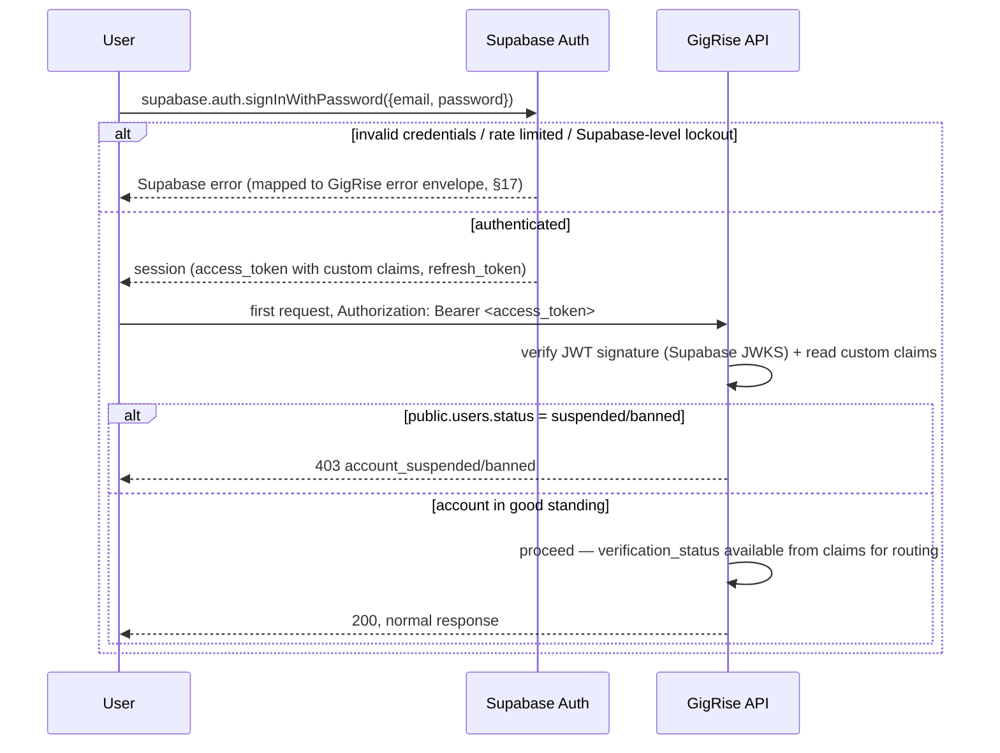

# GigRise — Authentication & Authorization Specification
**Version 2.0 — Amended: Supabase Auth Architecture**
**Status:** Design-only. No FastAPI, no Next.js, no migrations exist yet. Subordinate to [`ARCHITECTURE.md`](./ARCHITECTURE.md), [`DATABASE_ARCHITECTURE.md`](./DATABASE_ARCHITECTURE.md), [`DESIGN_SYSTEM.md`](./DESIGN_SYSTEM.md), and [`API_SPECIFICATION.md`](./API_SPECIFICATION.md). **This version supersedes v1.0's custom-built credential/session design**, per the decision recorded in [`DECISIONS.md`](./DECISIONS.md) and the amendment logged in [`CHANGELOG.md`](./CHANGELOG.md). The change originated from `PROJECT_SETUP.md` §0.1 adopting Supabase Auth as the platform's Identity Provider, and was formally reconciled in `CROSS_DOCUMENT_REVIEW.md` §5. **Section numbering below is unchanged from v1.0** — every other document's references to `AUTHENTICATION.md §N` remain valid; only section *content* changed.

---

## 0. What Changed, and the Ownership Boundary

**GigRise officially uses Supabase Auth as its Identity Provider.** Supabase owns: credential storage and verification, session issuance, refresh-token rotation, email verification, password reset, OAuth provider exchange, and MFA enrollment/challenge. None of that is rebuilt by GigRise — v1.0 of this document designed all of it from scratch (custom `password_hash` storage, self-issued RS256 JWTs, hand-built `sessions`/`refresh_tokens` tables, custom TOTP), and that design is **not what gets built**. Rebuilding credential/session mechanics that a managed, security-audited identity provider already does well was assessed and rejected — see `DECISIONS.md` ADR-001.

**What did not change, and is the actual subject of most of this document:** everything GigRise-specific that sits *on top of* whichever service issues the identity token —
- **RBAC** (`roles`/`permissions`/`role_permissions`/`user_roles`, §4–5)
- **The verification workflow** (draft → pending_review → approved/rejected/changes_requested, §2 steps 5–10, §12–13)
- **CRM permissions** (the eight named operational roles, `CRM_SPECIFICATION.md` §1)
- **Audit logging** (§16, now broadened to also ingest Supabase Auth's own auth events)
- **Profile workflow and business logic** (talent/hirer profile completion, contract/hiring flows — untouched by this amendment entirely)

None of that logic ever assumed a specific token issuer. That's why this amendment is a rewrite of *mechanics* (§1–3, §6–10), not a rewrite of *authorization design* (§4–5, §12–16 are carried forward with only attribution edits).

**Why this document still exists at all, given Supabase does the hard cryptographic part:** because "we use Supabase Auth" is not itself a specification. It doesn't say which claims a JWT carries, which of GigRise's five account states map onto Supabase's session model, what happens when a `pending_review` user logs in, or how an Admin's audit trail captures a Supabase-originated login event. That's what this document still specifies.

### 0.1 Ownership Boundary Table

| Concern | Owner |
|---|---|
| Credential storage, password verification | Supabase Auth (`auth.users`, internal to Supabase's schema) |
| Session issuance, refresh-token rotation, replay/reuse detection | Supabase Auth |
| JWT signing | Supabase Auth (project-level signing keys) |
| Email verification, password reset flows | Supabase Auth |
| OAuth code exchange | Supabase Auth |
| MFA enrollment/challenge | Supabase Auth |
| **`public.users` row** (role, status, mirrored `mfa_enabled`) | GigRise — 1:1 extension of `auth.users`, keyed by the same UUID (`public.users.id = auth.users.id`) |
| **RBAC** (`roles`, `permissions`, `role_permissions`, `user_roles`) | GigRise, fully unaffected (§4–5) |
| **Verification workflow** (`verification_requests`, `verification_reviews`, `verification_history`) | GigRise, fully unaffected (§12–13) |
| **JWT custom claims** (`role`, `talent_type`/`hirer_type`, `verification_status`) | GigRise-authored, injected via a **Supabase Custom Access Token Hook** (§5.1) — a database function Supabase calls at token-issuance time |
| **Account-status/verification-status business logic** (what a `suspended` or `pending_review` user can do) | GigRise, enforced in `apps/api` middleware after Supabase authenticates the request, not inside the authentication step itself |
| **Audit logging** | GigRise, now ingesting Supabase Auth webhook events in addition to GigRise-originated actions (§16) |

If a reader only takes one thing from this document, it should be this table — every section from here on is either "how GigRise configures/consumes Supabase Auth" or "what GigRise still owns outright."

---

## 1. Authentication Methods

| Method | Owner | Status | Notes |
|---|---|---|---|
| **Email + Password** | Supabase Auth | MVP | `supabase.auth.signUp()` / `signInWithPassword()`. Password hashing is Supabase's own (bcrypt) — see §10.1 for the honest trade-off this represents versus v1.0's originally-specified Argon2id. |
| **Google OAuth (OIDC)** | Supabase Auth | MVP | Configured as a Supabase Auth provider; the client SDK handles the redirect/callback exchange — GigRise no longer implements a custom OAuth callback handler (`API_SPECIFICATION.md` §2's prior design is removed, not adapted) |
| **Apple Sign-In** | Supabase Auth | Future (Phase 2) | Same provider-configuration pattern as Google — Supabase Auth supports it natively; adding it is a dashboard configuration change, not new GigRise code |
| **Magic Link** | Supabase Auth | Future-ready | `supabase.auth.signInWithOtp()` — already built into the provider, no longer a "when we get to it" custom build as v1.0 assumed |
| **OTP Verification (email)** | Supabase Auth | MVP | Same mechanism backs email verification (§8) |
| **OTP Verification (SMS)** | Supabase Auth | Future | Supabase Auth supports phone-based OTP natively when an SMS provider is configured — no GigRise-side OTP-generation code needed when this is prioritized |
| **TOTP MFA** | Supabase Auth | MVP-available, opt-in for Talent/Hirer, mandatory-offer for Admin/Super Admin | Native `supabase.auth.mfa.*` API — see §10.5 |
| **Passkeys / WebAuthn** | Supabase Auth (emerging support) | Future (§20) | Noted as a further reason this amendment reduces GigRise's own future build burden, not just its current one |

---

## 2. User Registration Flow

Matches `ARCHITECTURE.md` §4's journey exactly; the auth-specific mechanics at each step are now Supabase-mediated:

1. **Landing Page** → role-aware CTA.
2. **Choose Role** → `talent` or `hirer` (an application-level choice, captured client-side, not yet persisted to any auth record).
3. **Register** → client calls `supabase.auth.signUp({email, password})` directly against Supabase Auth — **GigRise's API no longer exposes a custom signup endpoint that owns credential creation.** Supabase creates the `auth.users` row and returns a session (access + refresh token) immediately, matching v1.0's deliberate "logged in before email is verified" behavior — this UX property is preserved, just relocated to Supabase's own default behavior rather than custom logic.
4. **Profile sync** — a Postgres trigger on `auth.users` (Supabase's recommended pattern) or a listener on Supabase's `user.created` auth webhook creates the corresponding `public.users` row (role, `status=active`) and fires the same `user.registered` event into `notification-service` that v1.0 specified. **This is new GigRise-owned integration code that v1.0 didn't need to specify, because v1.0 assumed GigRise's own signup endpoint did this step inline.**
5. **Email Verification** → Supabase Auth's native flow (§8), still gating nothing at login time — verification-gating remains a *feature-level* restriction, not a login-level one, exactly as v1.0 specified.
6. **Complete Profile** → unchanged — `PATCH /users/me/onboarding-step` still creates `talent_profiles`/`hirer_profiles` (GigRise-owned tables, never touched by Supabase).
7. **Submit for Verification** → unchanged — creates `verification_requests`, flips `verification_status → pending_review`.
8. **Pending Review → Admin Review → Approved/Changes Requested/Rejected → Access Platform** → entirely unchanged; this is GigRise business logic that never depended on the identity mechanism underneath it.

### 2.1 Sequence Diagram — Registration (amended)

Everything from "Complete Profile" onward is byte-for-byte the same diagram as v1.0 — the only amended portion is the registration step itself.

---

## 3. Login Flow

`supabase.auth.signInWithPassword()` (or the OAuth/magic-link equivalent) replaces the custom login handler — **Supabase decides whether the credential is valid; GigRise decides what an authenticated-but-not-yet-approved user can do next.** The outcome table from v1.0 still holds, reattributed:

| Scenario | Result | Owner of the check |
|---|---|---|
| **Successful login** | Supabase issues session; GigRise's session-created handling updates `public.users.last_login_at`, writes `audit_log_entries` | Supabase (credential) + GigRise (business-event logging) |
| **Wrong password** | Supabase returns its own error (generic, no enumeration — Supabase Auth already follows this practice) | Supabase |
| **Locked account** (too many recent failures) | Supabase Auth has its own baseline brute-force protection; GigRise's stricter per-account lockout policy (§10.2) is layered on top at the API-gateway level for any GigRise-owned endpoint called *after* a successful Supabase authentication | Supabase (baseline) + GigRise (stricter policy) |
| **Suspended / Banned account** | Supabase authentication succeeds (the credential is fine) — GigRise's middleware checks `public.users.status` on the first authenticated request after login and returns `403 account_suspended`/`account_banned` before any GigRise resource is served | GigRise |
| **Rejected / Pending / Changes-requested verification** | Login succeeds; GigRise's account-status endpoint (unchanged from v1.0) reports the state so the frontend can route to the correct screen | GigRise |
| **Deleted account** | Treated as "email not found" by Supabase for privacy — indistinguishable from a wrong-password failure | Supabase |

**Why this split still matches v1.0's original reasoning:** collapsing authentication and authorization was wrong regardless of who issues the token — a `pending_review` user must still be able to log in to check their status or message Support. That principle didn't change; only the party who says "yes, this password is correct" did.

### 3.1 Sequence Diagram — Login (amended)

---

## 4. Role-Based Access Control (RBAC) — Unchanged

Carried forward from v1.0 without modification, since none of it ever depended on the token issuer:

Coarse role lives on `public.users.role` (`talent`, `hirer`, `admin`, `super_admin`); Guest denotes the unauthenticated condition, not a stored role; `talent_type`/`hirer_type` are profile-level discriminators, not authorization roles.

| Role | What it fundamentally is | Access floor |
|---|---|---|
| **Guest** | Unauthenticated visitor | Public pages, approved profiles, open listings — read-only |
| **Creator / Actor** (`talent`) | Marketplace supply-side participant | Own profile CRUD, apply, message, review post-contract |
| **Brand / Casting Director** (`hirer`) | Marketplace demand-side participant | Own profile CRUD, post listings, hire, message, review post-contract |
| **Admin** | Internal staff, scoped by granted `permissions` | Nothing by default — every capability an explicit grant |
| **Super Admin** | Internal staff, full authority except the two things nobody can do (§16) | All Admin permissions + role/permission management + financial oversight |

---

## 5. Permission Matrices — Unchanged

All four matrices from v1.0 (Profile & Portfolio; Campaigns/Casting Calls/Applications/Contracts; Messaging & Reviews; Admin/Platform Governance) carry forward without modification — see `CRM_SPECIFICATION.md` §1/§5 for the fully-elaborated version including the eight named operational roles, which was already built to sit on top of this exact RBAC layer regardless of identity provider.

### 5.1 JWT Custom Claims — Supabase Access Token Hook (new, resolves a gap identified in `CROSS_DOCUMENT_REVIEW.md` §2.1/§5)

Supabase's default access token carries standard claims (`sub`, `email`, `aud`, `exp`, `role` in the Postgres-role sense, which is **not** the same thing as GigRise's `public.users.role` and must not be confused with it). GigRise requires `role` (talent/hirer/admin/super_admin), `talent_type`/`hirer_type`, and `verification_status` to be readable directly off the token without an extra database round-trip per request — this is achieved via a **Custom Access Token Hook**: a Postgres function, registered with Supabase Auth, that runs at token-issuance time (every login and every refresh) and injects these fields into the JWT under a namespaced custom claim (e.g., `app_metadata.gigrise`) by reading `public.users`/`talent_profiles`/`hirer_profiles` for the authenticating user.

**Consequence of this design:** because the hook runs at issuance time, a claim like `verification_status` is only as fresh as the token's lifetime (§6) — a status change (e.g., an Admin approving a profile) is reflected the next time the token is refreshed, not instantly. Given the 15-minute access-token lifetime (§6), this is an acceptable staleness window, consistent with how v1.0 always treated claims as a point-in-time snapshot, not a live value. **`permissions[]` (the fine-grained Admin permission list) is deliberately *not* embedded in the JWT** — unlike the coarse role/verification_status fields, an Admin's specific permission grants can change more dynamically (temporary permissions, `CRM_SPECIFICATION.md` §16) and are checked live against `role_permissions`/`user_roles` at the API gateway layer (§14) rather than trusted from a token that could be stale for up to 15 minutes on a security-sensitive check.

---

## 6. Session Management

- **Access Token:** JWT, issued and signed by Supabase Auth. **Confirmed lifetime: 15 minutes**, requiring the project's JWT expiry setting to be explicitly configured away from Supabase's 1-hour default — this was flagged as an unresolved mismatch in `CROSS_DOCUMENT_REVIEW.md` §2.1 and is now the confirmed working assumption throughout this document (see `DECISIONS.md` ADR-002 and the consolidated founder-decision list for sign-off status).
- **Refresh Token:** issued and rotated by Supabase Auth. Supabase's refresh-token rotation includes **built-in reuse detection** — presenting an already-rotated-past refresh token revokes the session chain, which is the same replay-detection property v1.0 designed custom (a hand-built `refresh_tokens` table with rotation chains) and now gets natively from the provider at no additional engineering cost.
- **Expiration:** access token 15 minutes (above); refresh token governed by Supabase's project-level session settings — GigRise configures these to match the previously-specified 30-day sliding / 90-day absolute-maximum policy rather than accepting Supabase's defaults uninspected.
- **Idle Timeout:** same 14-day idle-expiry principle as v1.0, implemented via Supabase's session inactivity settings rather than a custom sweep job over a GigRise-owned `sessions` table (which no longer exists).
- **Remember Me:** implemented client-side via which Supabase session-persistence mode the client requests at sign-in (persistent vs. in-memory-only session) — same functional behavior as v1.0, different mechanism.
- **Multiple Devices:** unchanged in principle — Supabase Auth supports multiple concurrent sessions per user natively; there is no single-session-per-user constraint.
- **Logout / Logout All Devices:** `supabase.auth.signOut({scope: 'local'})` for current-device logout, `{scope: 'global'}` for all-devices — GigRise's logout endpoints (if kept at all) become thin wrappers that also trigger GigRise's own audit-log write, rather than independently revoking a GigRise-owned token table.
- **Device Tracking / Active Sessions List:** sourced from Supabase Auth's Admin API (`supabase.auth.admin.listUserSessions` or equivalent), surfaced in the Settings UI (`DESIGN_SYSTEM.md` §19.6) exactly as before — the data source changed, the UI and user-facing behavior did not.
- **Session Revocation:** available to the user (their own sessions, via the Supabase client SDK) and to an Admin with `users:suspend` (via Supabase's Admin API to force-revoke all of a user's sessions as part of a suspension action) — the "suspension pushes an immediate revocation, not just a database flag" property from v1.0 is preserved, now implemented against Supabase's session-revocation API instead of a custom table update.

---

## 7. Web vs. Mobile vs. Future Desktop

The underlying principle from v1.0 is unchanged and, if anything, easier to guarantee now: **tokens are never handled as raw values by GigRise application code** — the Supabase client SDK owns storage on every platform.

| Platform | Token storage | Mechanism |
|---|---|---|
| **Web (Browser)** | `httpOnly` cookie (access + refresh), managed by `@supabase/ssr` | GigRise's Next.js apps never read the raw token from JS — the SDK's server-side helpers attach it to requests |
| **Android** | Android Keystore-backed encrypted storage | Supabase's Kotlin/Android SDK's built-in secure-storage adapter |
| **iOS** | iOS Keychain | Supabase's Swift SDK's built-in secure-storage adapter |
| **Future Desktop** | OS credential store | Same SDK-provided adapter pattern — no new GigRise code required when this ships |

**What this means concretely for `apps/api` (FastAPI):** the backend never issues, stores, or rotates a token — it only **verifies** incoming JWTs against Supabase's published JWKS endpoint on every request. This is a stateless verification, identical in spirit to v1.0's RS256 design, except GigRise no longer manages the signing key pair — Supabase does.

---

## 8. Email Verification

Native Supabase Auth flow. Functional behavior preserved from v1.0: 24-hour token expiry, resend capability, and distinct outcomes for invalid/expired/already-verified — but the **error codes Supabase returns are Supabase's own**, not GigRise's `API_SPECIFICATION.md` §19 envelope. **New requirement identified during this amendment (not present in v1.0): a translation layer at the API gateway maps Supabase's auth-flow error responses onto GigRise's standard error envelope**, so a frontend never has to branch on two different error shapes depending on whether a failure originated from Supabase Auth directly (e.g., during `signUp`) or from a GigRise-owned endpoint downstream of authentication. Email is sent via Supabase Auth's configurable custom SMTP, pointed at Resend (`PROJECT_SETUP.md` §1.4) — the actual template copy is still authored/edited via the `email_templates` table and Content Manager tooling (`CRM_SPECIFICATION.md` §7), synced into Supabase's template configuration rather than rendered by a GigRise-owned send path.

---

## 9. Password Reset

Native Supabase Auth flow (`resetPasswordForEmail` / `updateUser`), same 1-hour token expiry and no-enumeration behavior as v1.0 specified, same error-translation-layer requirement as §8. On successful reset, Supabase Auth invalidates existing sessions as part of its own reset flow — the "force re-authentication on password change" property from v1.0 is preserved.

---

## 10. Account Security

### 10.1 Password Rules — honest note on a real change
Minimum 10 characters, one number, one symbol — configured as Supabase Auth's project-level password policy rather than validated in GigRise application code. **Hashing is Supabase Auth's own implementation, which uses bcrypt, not the Argon2id originally specified in v1.0 and `DATABASE_ARCHITECTURE.md` §2.** This is flagged explicitly rather than glossed over: bcrypt is still an industry-standard, well-audited algorithm and Supabase's implementation is maintained by a team whose entire product is identity infrastructure — this is assessed as an acceptable trade (not a security regression in practice) in exchange for not maintaining bespoke credential-storage code at all. See `DECISIONS.md` ADR-017 for the full reasoning.

### 10.2 Account Lockout & Brute-Force Protection
Supabase Auth provides baseline brute-force protection at the provider level. GigRise's stricter, product-specific lockout policy (5 failed attempts / 15 minutes → 15-minute account lock, independent of per-IP limits) is layered on top at the API gateway for GigRise-owned endpoints, since Supabase's baseline protection is necessarily generic across all its customers and not tuned to GigRise's specific risk tolerance.

### 10.3 Rate Limiting & IP Protection
Unchanged — `API_SPECIFICATION.md` §1.7's tiered rate limiting is enforced at the GigRise API gateway regardless of identity provider; it governs GigRise endpoints, not the Supabase Auth calls themselves (which have their own provider-side limits).

### 10.4 Bot Detection
CAPTCHA remains a GigRise frontend integration at signup/repeated-failed-login — Supabase Auth has since added native CAPTCHA provider integration as an option, which reduces GigRise's implementation burden if adopted (flagged as a future simplification, not required for MVP).

### 10.5 TOTP Multi-Factor Authentication
Native Supabase Auth MFA (`supabase.auth.mfa.enroll()` / `.challenge()` / `.verify()`) replaces the custom TOTP flow v1.0 designed. GigRise's job is enforcement policy, not cryptography: prompting Admin/Super Admin accounts to enroll at first login (mandatory-offer per `ARCHITECTURE.md` §15), and — if the founder decision in `CROSS_DOCUMENT_REVIEW.md`'s consolidated list resolves toward hard-mandatory for these roles — gating CRM access behind a completed MFA enrollment via a GigRise-side middleware check on the `admin`/`super_admin` role, reading MFA-enrollment status from the Supabase-issued claim.

### 10.6 Device Recognition
Not a Supabase Auth feature — remains GigRise-built, now sourced from Supabase Auth's sign-in event webhooks rather than a custom `sessions` table: a login from an unrecognized device/IP combination (tracked in a small GigRise-owned lookup, not a full session-mirroring table) triggers the same informational "new device" email as v1.0 specified, still purely a detection signal, never an access-control gate.

---

## 11. Multi-Device Support — Unchanged
Phone, tablet, desktop browser, multiple browsers are all independent Supabase Auth sessions — no architectural distinction between them. The Active Sessions screen (§6) renders them uniformly. Trusted Devices remains a Future feature (§20).

---

## 12. Verification Status × Account Status — Combined Access Table (Unchanged)

This entire table is GigRise business logic, never touched by the identity-provider question, carried forward verbatim from v1.0:

| `public.users.status` | `verification_status` | Can log in? | Can browse/discover? | Can apply/hire/message? | Can edit profile? | Notes |
|---|---|---|---|---|---|---|
| active | draft | ✅ | ✅ (read-only) | ❌ | ✅ | Pre-submission |
| active | pending_review | ✅ | ✅ | ❌ | ⚠️ limited (open item, unchanged from v1.0) | Sees `/onboarding/pending` |
| active | changes_requested | ✅ | ✅ | ❌ | ✅ | Resubmission loop |
| active | approved | ✅ | ✅ | ✅ | ✅ | Full access |
| active | rejected | ✅ | ✅ (read-only) | ❌ | ❌ | Terminal-but-appealable |
| suspended | any | ❌ | — | — | — | Blocked at `403` by GigRise middleware post-authentication |
| banned | any | ❌ | — | — | — | Same, non-reversible by Support |
| deactivated (self-initiated) | any | ✅ (re-activates within recovery window) | — | — | — | User's own choice, reversible |
| soft-deleted, past recovery window | any | ❌ | — | — | — | Indistinguishable from invalid credentials |

---

## 13. Admin Verification Workflow — Unchanged
Fully specified operationally in `API_SPECIFICATION.md` §5.1 and `DESIGN_SYSTEM.md` §9; the reason-required enforcement (UI + API + database, three redundant layers) is entirely GigRise business logic and carries forward without modification.

---

## 14. Authorization Layers

Same four-layer defense-in-depth model as v1.0, with layer 1 reattributed:

1. **Frontend Route Guards:** now read the Supabase session object and its custom claims (§5.1) rather than a GigRise-decoded JWT — functionally identical, UX convenience only.
2. **API Gateway Authorization:** verifies the Supabase-issued JWT's signature (via Supabase's JWKS) and reads the custom `role`/`verification_status` claims, checked against the endpoint's declared requirement.
3. **Service-Level Authorization:** unchanged — fine-grained `permissions` and resource-ownership checks (`WHERE hirer_id = current_user`) in `apps/api`'s `repositories/` layer.
4. **Database-Level RLS:** **arguably strengthened by this change** — Supabase RLS policies are natively built around `auth.uid()`, which is exactly the ownership-check pattern `DATABASE_ARCHITECTURE.md` §1.6/§15 already assumed; adopting Supabase Auth means this layer's implementation is now a first-class, provider-supported pattern rather than a custom convention GigRise had to enforce itself.

---

## 15. File Security — Unchanged
Governed by Supabase Storage's own RLS-backed signed-URL mechanism, which `PROJECT_SETUP.md` §0.4 already assumed — the access-control table from v1.0 (public CDN media, private documents via signed URL, message attachments) carries forward exactly.

---

## 16. Audit Logging (auth-relevant scope)

The broadened scope from v1.0 (capturing self-service security events, not just Admin actions) is unchanged and now has one additional input: **Supabase Auth's own webhook events** (`user.created`, sign-in events, password-change events) are ingested by a GigRise listener and written to `audit_log_entries` in the same shape as before — the event *source* changed from "a GigRise endpoint handled this directly" to "Supabase told us this happened," but the destination table, its immutability (`DATABASE_ARCHITECTURE.md` §10's `REVOKE`), and its `ip_address`/`user_agent` columns (added per `CROSS_DOCUMENT_REVIEW.md` §2.3, see `DATABASE_ARCHITECTURE.md` v1.1) are unchanged.

**Canonical `action` vocabulary:** per `CROSS_DOCUMENT_REVIEW.md` §2.2's finding that this was scattered across documents, the full list now lives in `DATABASE_ARCHITECTURE.md` §10's appendix as the single source of truth — this document's event list (`auth.login_succeeded`, `auth.password_changed`, etc.) references that appendix rather than restating it independently.

---

## 17. Error Handling

Extends `API_SPECIFICATION.md` §19, with one structural addition from this amendment: **Supabase Auth error responses (returned directly to the client during `signUp`/`signInWithPassword`/etc.) are mapped onto GigRise's standard error envelope by a translation layer** at the point the frontend SDK call resolves, so error-handling code in `apps/web`/`apps/admin` never branches on "was this a Supabase error or a GigRise error" — from the application's perspective there is one error shape.

| Status | Code | Meaning | Origin |
|---|---|---|---|
| 401 | `invalid_credentials` | Wrong password/unknown email/deleted account | Supabase, translated |
| 401 | `token_expired` | Access token past 15-min expiry | Supabase, translated |
| 401 | `refresh_token_reused` | Supabase's built-in reuse detection triggered | Supabase, translated |
| 401 | `mfa_required` | Intermediate MFA-challenge state | Supabase, translated |
| 403 | `permission_denied` | Authenticated, wrong permission/role | GigRise |
| 403 | `account_suspended` / `account_banned` | Account-level block | GigRise |
| 403 | `unverified_action` | `approved`-gated action attempted while not approved | GigRise |
| 423 | `account_locked` | GigRise's stricter lockout policy (§10.2) | GigRise |
| 400 | `invalid_verification_token` / `verification_token_expired` / `invalid_reset_token` | Supabase Auth token failures | Supabase, translated |
| 409 | `email_already_verified` | Idempotent-friendly | Supabase, translated |
| 429 | `rate_limited` | GigRise gateway tier breach | GigRise |

---

## 18. Security Best Practices

- **JWT Security:** signing now managed entirely by Supabase (project signing keys, key rotation handled by the provider) — GigRise verifies against the published JWKS rather than managing its own key pair, removing an entire category of key-management risk from GigRise's operational surface.
- **CSRF/XSS/SQLi/Replay/Session Fixation/Token Theft:** the reasoning from v1.0 is unchanged in substance — access tokens never touch `localStorage`, refresh tokens are `httpOnly`/OS-secure-storage only, replay is defeated by rotation+reuse detection — every one of these properties is now provided by Supabase's SDK/provider implementation rather than GigRise's own code, which if anything reduces the surface area GigRise itself has to get right.
- **Password hashing:** bcrypt via Supabase, not Argon2id — see §10.1's explicit honesty note.

---

## 19. Scalability — Unchanged, Arguably Improved
Stateless JWT verification still requires zero database lookup per request; the tables under real write pressure in v1.0 (`sessions`, `refresh_tokens`) **no longer exist as GigRise-owned tables at all** — that write load is now Supabase's operational responsibility, not GigRise's. `DATABASE_ARCHITECTURE.md` §18.6's scaling ladder is unaffected in every other respect.

---

## 20. Future Features
Unchanged from v1.0 in substance, with one addition: Supabase Auth's own evolving support for Passkeys/WebAuthn (§1) means several of v1.0's "future, would need a new table" items (`webauthn_credentials`) may arrive as a Supabase-provided capability requiring only configuration, further reducing GigRise's own future build burden — noted here as a positive trend, not yet a confirmed replacement for the schema-level plan in v1.0.

---

## 21. Implementation Readiness

### 21.1 Open Founder Decisions (updated — several v1.0 items are now resolved by this amendment)
- ~~Mobile refresh-token transport~~ **Resolved** — the Supabase SDK's own per-platform secure-storage adapters make this a solved problem, not a GigRise design choice (§7).
- **Confirm the 15-minute access-token / 30-day-sliding / 90-day-absolute refresh policy is actually configured in the Supabase project**, since it requires overriding Supabase's defaults (§6) — still open.
- **MFA enforcement level for Admin/Super Admin** — mandatory-offer vs. hard-mandatory (§10.5) — still open.
- **Editable fields during `pending_review`** (§12) — still open, unaffected by this amendment.
- **Failed-login audit retention policy** (§16) — still open, unaffected by this amendment.
- **Confirm the bcrypt-vs-Argon2id trade-off (§10.1) is acceptable**, given it wasn't the founder's original assumption in v1.0.

### 21.2 Potential Security Risks (if left unresolved)
- Leaving the MFA enforcement level undecided (§10.5) risks Admin/Super Admin accounts operating without MFA indefinitely if "mandatory-offer" is silently treated as "optional forever" by busy staff.
- Leaving the access-token/refresh-token lifetime confirmation undone (§6) risks the Supabase project quietly running on its 1-hour default rather than the 15-minute figure this document's entire security reasoning assumes — this is the single most important configuration value to verify before launch, precisely because it's easy to forget it isn't the platform default.
- Skipping the Supabase-error-to-GigRise-envelope translation layer (§8/§9/§17) risks inconsistent error handling across the frontend, which historically is where subtle auth bugs (e.g., silently swallowed failures) hide.

### 21.3 Future Improvements
- Passkeys/WebAuthn (§20) as the eventual primary auth method, now plausibly arriving as a Supabase-provided capability rather than custom GigRise work.
- Risk-based/adaptive MFA (step-up authentication only on anomalous logins) once enough Supabase Auth sign-in telemetry exists to build that model responsibly.
- Promoting device recognition (§10.6) from a simple "new device" email into a full Trusted Devices feature (§11) that can skip an MFA challenge on a previously-verified device.

### 21.4 Recommended Implementation Order (amended)
1. Supabase project setup + Custom Access Token Hook (§5.1), tested against every claim this document assumes is readable (`role`, `talent_type`/`hirer_type`, `verification_status`).
2. `public.users` as an `auth.users` extension + the registration-sync integration (§2, step 4) — the one new integration point this amendment introduces.
3. RBAC/permission middleware at the API gateway (§14 layers 2–3) — unchanged in design, now consuming Supabase-issued claims instead of self-issued ones.
4. Verification workflow integration (§2 steps 7–8, §13) — unchanged.
5. Session management UI (Active Sessions, logout-all) now against Supabase's Admin API (§6) rather than a custom table.
6. MFA (§10.5) via Supabase's native flow — can ship any time after (1).
7. **Audit logging integration, including the new Supabase-webhook ingestion path (§16), should be wired into steps (1)–(4) as they're built, not retrofitted after** — retrofitting audit coverage onto already-shipped mutation endpoints is exactly the kind of gap that gets missed.

### 21.5 Dependencies Before Coding
- Supabase project provisioned, with password policy, JWT expiry, and MFA settings configured away from defaults per §6/§10.
- Custom Access Token Hook (§5.1) implemented and tested — this is the one piece of genuinely new GigRise code this amendment requires, and it should be built and tested before any RBAC-dependent feature.
- Resend configured as Supabase Auth's custom SMTP provider (§8).
- The Supabase-error-to-GigRise-envelope translation layer (§8/§9/§17) implemented at the API gateway.

---

*End of authentication and authorization specification, v2.0. Amendment recorded in `CHANGELOG.md`; decision rationale recorded in `DECISIONS.md` ADR-001/ADR-002/ADR-017. Subordinate to `ARCHITECTURE.md`, `DATABASE_ARCHITECTURE.md`, `DESIGN_SYSTEM.md`, and `API_SPECIFICATION.md`; awaits founder resolution of §21.1 before implementation begins.*
