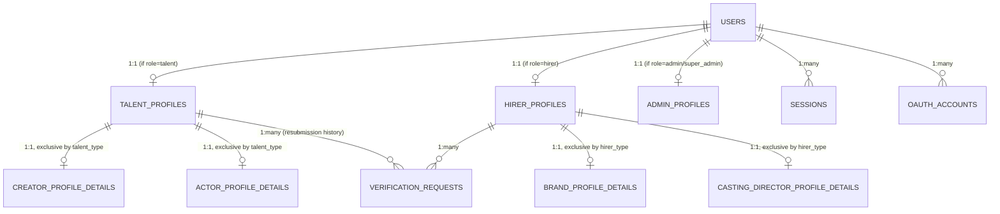
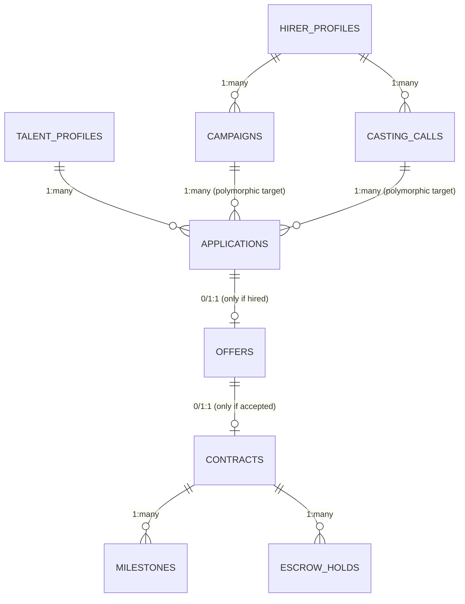
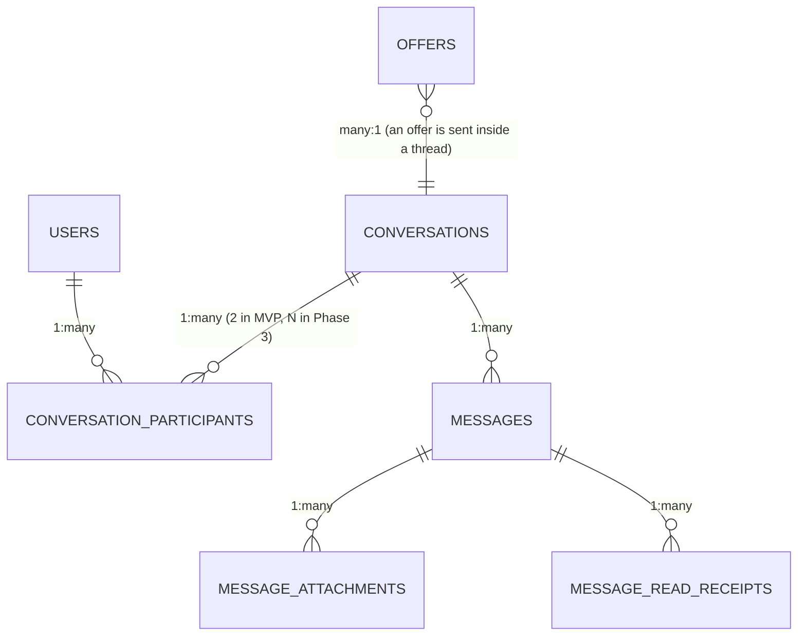
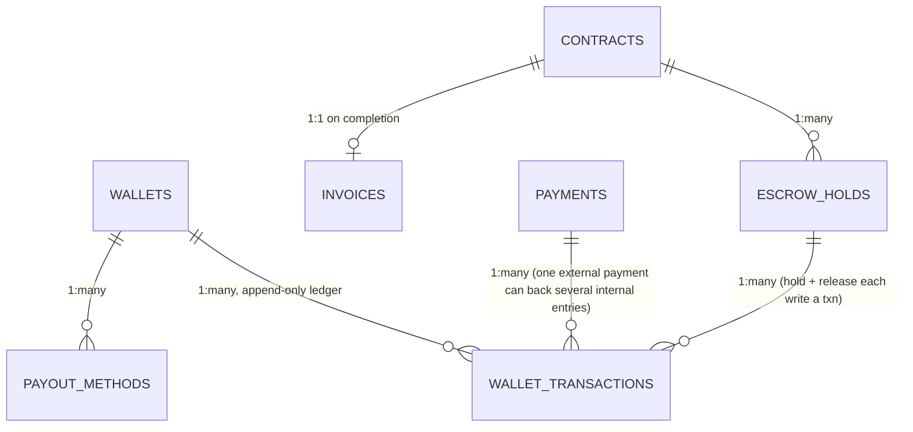

# GigRise — Database Architecture
**Version 1.1 — Amended per Cross-Document Review**
**Status:** Design-only. No SQL, no ORM schema, no migrations exist yet. This document is the single source of truth for the data layer, subordinate to [`ARCHITECTURE.md`](./ARCHITECTURE.md). **v1.1 applies every schema amendment identified in `CROSS_DOCUMENT_REVIEW.md`** — see `CHANGELOG.md` for the itemized list and `DECISIONS.md` for the reasoning behind the largest single change (the `users`/`sessions`/`refresh_tokens`/`oauth_accounts` redefinition following the Supabase Auth decision). Amendments are marked inline as **Amended (v1.1)** or **new table, v1.1** so original design and amendment are distinguishable without cross-referencing the changelog line by line.

---

## 0. Relationship to ARCHITECTURE.md

`ARCHITECTURE.md` §9 established the entity clusters at a conceptual level (Identity, Portfolio, Discovery, Engagement, Financial, Trust, Platform) and deliberately stopped short of table-level detail. This document is that detail.

Wherever this document's required table list (as specified by the founder's request) implies something more granular, more consolidated, or structurally different than §9's model, **it is called out explicitly in-line as a "Reconciliation" note** rather than silently overriding the parent document. Every reconciliation is also summarized in §12 (Open Questions) for founder sign-off. Nothing here contradicts `ARCHITECTURE.md`'s stated goals (§2), roles (§3), or the scalability model (§23) — it only adds the resolution needed to actually build the schema.

Target engine: **PostgreSQL** (via Supabase), which informs several decisions below (native `ENUM`/`CHECK` types, Row Level Security as a defense-in-depth layer, `pgcrypto`/`uuid` generation, native partitioning, `tsvector` full-text search as an MVP-stage search layer).

---

## 1. Global Design Conventions

These apply to every table below unless a table explicitly overrides one. Stating them once here — rather than repeating "id: uuid, PK" 90 times — is itself a maintainability decision: a future schema reviewer should be able to spot an exception by its absence from the convention, not have to diff 90 near-identical blocks.

### 1.1 Primary Keys — UUID (v7), not auto-increment integers
Every table's PK is a UUIDv7 (time-ordered UUID), generated application-side or via a Postgres extension/default.

**Why:** Sequential integer IDs leak business metrics (a competitor watching `/campaigns/48213` vs `/campaigns/48119` a week later can estimate campaign volume) and make ID enumeration attacks trivial. Random UUIDv4 avoids that but fragments B-tree indexes under high insert volume because new keys land randomly across the index rather than at the tail. UUIDv7 keeps the time-ordered locality of an auto-increment integer (good insert performance, good index cache locality) while remaining non-sequential/non-guessable and safe to generate **client-side** (mobile app can create a `Message` row with its final ID before the network round-trip completes — critical for the offline-safe messaging design in `ARCHITECTURE.md` §19). It's also the correct choice ahead of any future sharding (§11): a UUID never collides across shards; a per-shard auto-increment integer does.

### 1.2 Timestamps
- `created_at timestamptz not null default now()` — every table.
- `updated_at timestamptz not null default now()` — every table where rows are ever mutated after creation (trigger-maintained). **Omitted** on append-only/immutable tables (audit logs, ledger transactions, verification history, analytics events) — omission is deliberate signal that a table is immutable, not an oversight.
- `deleted_at timestamptz null` — every table subject to soft delete (§9). Omitted on tables that are immutable by nature (a `Transaction` is never deleted, only ever superseded by a compensating transaction) or that are pure join/lookup tables with no independent lifecycle (e.g., `TalentProfileSkills`).

### 1.3 Soft Delete Enforcement
`deleted_at IS NULL` is enforced as the default visibility scope via a Postgres **Row Level Security policy** (not just an application-layer `WHERE` clause the ORM might forget) on every soft-deletable table. This means even a raw SQL query run by a compromised or buggy service account still can't see soft-deleted rows without an explicit privilege escalation — see §10.

### 1.4 Enums: native `ENUM`/`CHECK` vs. lookup tables
Two patterns are used, deliberately not one:
- **Native Postgres `ENUM` type** for small, closed, rarely-changing state-machine values that appear in `WHERE`/`CHECK` logic across the app (e.g., `contract_status`, `verification_status`, `user_role`). Adding a value requires a migration — that's a *feature*, not a limitation, for state machines: a new contract state should never be introducible without an engineering review.
- **Lookup table** (its own PK, name, slug, active flag) for open-ended, admin-editable value sets that a non-engineer needs to extend (e.g., `skills`, `talent_categories`, `languages`, `campaign_categories`). Adding "TikTok Live Hosting" as a new skill must be an Admin CRM action, not a deploy.

### 1.5 Money
All monetary amounts are stored as **integers in minor currency units** (cents/paise), paired with an ISO 4217 `currency_code char(3)` column on the same row. Never `float`/`numeric` with implied decimal rounding assumptions. This is standard fintech practice and directly supports `ARCHITECTURE.md` §20's multi-currency requirement without a later migration.

### 1.6 Row Level Security (RLS)
Supabase makes Postgres RLS a first-class tool, and it is used here as **defense-in-depth beneath** application-layer RBAC (`ARCHITECTURE.md` §15) — not a replacement for it. Application code still enforces authorization; RLS is the backstop that holds even if application code has a bug. Policies are summarized per-table where non-obvious and consolidated in §10.

### 1.7 Naming
`snake_case`, plural table names, singular column names, FK columns named `<referenced_singular>_id` (e.g., `talent_profile_id`), matching `ARCHITECTURE.md` §24.

### 1.8 Partitioning candidates
Any table flagged **[PARTITION CANDIDATE]** below is expected to be range-partitioned by month on `created_at` once row count materially exceeds tens of millions — flagged now, not implemented now (see §11).

---

## 2. Module: Authentication

### `users` — **AMENDED v1.1: now a 1:1 extension of Supabase Auth's `auth.users`, not a standalone credential store**
**Why this changed:** `AUTHENTICATION.md` v2.0 and `PROJECT_SETUP.md` §0.1 adopted **Supabase Auth** as GigRise's Identity Provider (see `DECISIONS.md` ADR-001). Supabase Auth owns `auth.users` — credential storage, password hashing, email/phone verification state — internally, in its own schema. `public.users` (this table) no longer stores `password_hash`, and no longer owns `email`/`email_verified_at`/`phone`/`phone_verified_at` as authoritative columns; it holds only what's GigRise-specific, keyed 1:1 to the Supabase identity.

**Purpose:** The GigRise-owned identity extension — role and account status for every actor on the platform. Every other identity table (`talent_profiles`, `hirer_profiles`, `admin_profiles`) still hangs off this table 1:1, exactly as before; only this table's own contents and its relationship to credential storage changed.

| Column | Type | Null | Default | Notes |
|---|---|---|---|---|
| id | uuid | No | — | PK, **and FK to `auth.users.id`** — not independently generated; this row is created by a trigger/webhook listener when Supabase Auth creates the corresponding `auth.users` row (`AUTHENTICATION.md` §3, step 4) |
| email | citext | No | — | **Mirrored from `auth.users.email` for query convenience only** (e.g., admin search) — Supabase Auth remains authoritative; this column is kept in sync via the same webhook that creates the row, not treated as a second source of truth |
| role | user_role (enum) | No | — | `talent`, `hirer`, `admin`, `super_admin` |
| status | account_status (enum) | No | `'active'` | `active`, `suspended`, `banned`, `deactivated` |
| mfa_enabled | boolean | No | false | Mirrored from Supabase Auth's MFA-factor state (`AUTHENTICATION.md` §10.5) for query convenience |
| last_login_at | timestamptz | Yes | null | Updated by GigRise on receipt of a Supabase Auth sign-in webhook event (`AUTHENTICATION.md` §3) |
| created_at / updated_at / deleted_at | timestamptz | see §1.2 | | |

**Relationships:** 1:1 → `auth.users` (Supabase-managed, outside this schema). 1:1 → `talent_profiles` OR `hirer_profiles` OR `admin_profiles` (exactly one, enforced at application layer — see Reconciliation note in §12). 1:many → `notifications`, `audit_log_entries` (as actor). **`sessions`, `refresh_tokens`, `oauth_accounts` (originally specified below) are removed from this schema — see the amended note at the end of this subsection.**
**Cascade:** Soft-delete only; hard delete never cascades. On account deletion request, `public.users` is soft-deleted, its mirrored `email` is anonymized, **and GigRise calls the Supabase Admin API to anonymize/delete the corresponding `auth.users` row** — this second step is new as of this amendment and is detailed in the amended §16 GDPR note, since v1.0's anonymization procedure only accounted for GigRise-owned columns.
**Indexes:** INDEX(role, status) for admin filtering; UNIQUE on `email` is now enforced by Supabase Auth on `auth.users`, not redundantly here.
**Row growth:** 1 row per registrant — unchanged.
**Future expansion:** unchanged.

### `sessions`, `refresh_tokens`, `oauth_accounts` — **REMOVED as of v1.1, superseded by Supabase Auth**
v1.0 of this document specified these three tables in full (session tracking, rotating refresh tokens with replay detection, and linked OAuth identities). **All three are superseded by Supabase Auth's internal session/token/identity management** (`AUTHENTICATION.md` §7, §12) and are not built as GigRise-owned tables. Where this document is read alongside `AUTHENTICATION.md` v2.0: "Active Sessions" UI (`DESIGN_SYSTEM.md` §21.4) is now backed by Supabase's Admin API (`supabase.auth.admin.listUserSessions` or equivalent), not a query against a table in this schema. If a future need arises for GigRise to track something about a session that Supabase's API doesn't expose (e.g., a GigRise-specific device label), a small `session_metadata` table keyed by Supabase's session ID would be the additive way to do it — not a reintroduction of the original three tables.

### `roles`, `permissions`, `role_permissions`
**Purpose:** `users.role` covers the four coarse roles cheaply for 99% of authorization checks, but `ARCHITECTURE.md` §15 requires *scoped* Admin permissions ("an Admin can approve verifications but not touch financials"). These three tables implement that fine-grained layer for `admin`/`super_admin` users only — talent/hirer roles never need row-level permission grants, so this machinery doesn't burden the majority of accounts.

**`roles`**: `id (uuid, PK)`, `name (text, UNIQUE)`, `is_system_role (boolean)`, `created_at`. Seeded rows: `verification_admin`, `finance_admin`, `support_admin`, `super_admin`.
**`permissions`**: `id (uuid, PK)`, `key (text, UNIQUE)` e.g. `verification:review`, `financials:view`, `users:suspend`, `description (text)`.
**`role_permissions`**: `role_id (FK→roles)`, `permission_id (FK→permissions)`, composite PK on both. Pure join table, no independent lifecycle, no soft delete.
**`user_roles`**: `user_id (FK→users)`, `role_id (FK→roles)`, composite PK — a `super_admin` user can hold multiple scoped roles. **Amended (v1.1):** adds `expires_at (timestamptz, nullable)` — supports temporary/time-boxed permission grants (`CRM_SPECIFICATION.md` §16, e.g. "grant refund permission for 24 hours during an incident"); a nullable value means the grant is permanent, a set value means a scheduled sweep job (analogous to the token-expiry sweeps already described elsewhere in this document) revokes it automatically once past due.

**Canonical `permissions.key` vocabulary (v1.1 addition — consolidates keys previously scattered across `API_SPECIFICATION.md` and `CRM_SPECIFICATION.md`):** `verification:review`, `documents:view`, `moderation:review`, `reports:resolve`, `reports:view`, `financials:view`, `financials:refund`, `financials:adjust`, `content:manage`, `campaigns:manage`, `users:view`, `users:suspend`, `users:impersonate`, `roles:manage`, `system:manage`, `audit:view`, `support:view`, `support:respond`, `support:escalate`. This is the single seed-data list every specialist role in `CRM_SPECIFICATION.md` §1 is composed from — no document should introduce a new permission key without adding it here first.

**Cascade:** `ON DELETE CASCADE` on the join tables only (deleting a role definition removes its grants; it never touches `users`).
**Row growth:** All four tables stay in the tens-to-hundreds of rows regardless of platform size — this is configuration, not user data.
**Notes:** This is the schema-level backing for the Super Admin "Role Management" CRM module (`ARCHITECTURE.md` §8).

### `sessions`, `refresh_tokens`, `oauth_accounts` — see the amended note under `users` above
These three tables, as specified in v1.0 of this document, are **not built** — Supabase Auth owns session tracking, refresh-token rotation/replay-detection, and OAuth-identity linkage internally. See `AUTHENTICATION.md` v2.0 §7/§12 for the full mechanics and `DECISIONS.md` ADR-001 for the rationale.

---

## 3. Module: Professional Profiles

**Reconciliation note (see §12 for founder sign-off):** The founder's table list requests six separate tables — Creator, Actor, Brand, Casting Director, Admin, Super Admin Profiles. `ARCHITECTURE.md` §9 instead proposed two shared base tables (`TalentProfile`/`HirerProfile` with a type discriminator) specifically so a 5th role is additive. This document reconciles both requirements using **class-table inheritance**: one shared base table per side (carrying every field Creator/Actor — or Brand/Director — have in common, plus discoverability/verification/search fields), and a 1:1 **detail extension table** per concrete type carrying only that type's distinct fields. This satisfies the founder's explicit "Creator Profiles / Actor Profiles" table-level request while preserving the architectural property `ARCHITECTURE.md` was optimizing for. Admin/Super Admin are handled differently (§3.4) because they are not marketplace-discoverable profiles.

### 3.1 `talent_profiles` (base — Creator + Actor shared fields)
**Purpose:** Everything true of *any* talent regardless of type: identity display, location, bio, verification status, aggregate trust signals. This is the row that `search_service` indexes, that a public profile URL resolves to, and that `reviews`/`applications`/`contracts` reference — so that adding a third talent type later never requires touching those referencing tables.

| Column | Type | Null | Default | Notes |
|---|---|---|---|---|
| id | uuid | No | uuid_generate_v7() | PK |
| user_id | uuid | No | — | FK → users.id, UNIQUE |
| talent_type | talent_type (enum) | No | — | `creator`, `actor` |
| handle | citext | No | — | UNIQUE, public profile slug |
| display_name | text | No | — | |
| headline | text | Yes | null | |
| bio | text | Yes | null | |
| location_city | text | Yes | null | |
| location_country | char(2) | Yes | null | ISO 3166-1 |
| verification_status | verification_status (enum) | No | `'draft'` | `draft`,`pending_review`,`approved`,`rejected`,`changes_requested` |
| avatar_media_id | uuid | Yes | null | FK → media_assets.id |
| profile_completeness_pct | smallint | No | 0 | denormalized cache, recomputed on relevant writes |
| avg_rating | numeric(3,2) | Yes | null | denormalized from `rating_summaries` — see 8.3 |
| response_rate_pct | smallint | Yes | null | denormalized, recomputed by scheduled job |
| availability_status | availability_status (enum, nullable) | Yes | null | `available`, `booked`, `unavailable` — **added v1.1**, resolves the gap flagged in `API_SPECIFICATION.md` §4.5 |
| available_from | date | Yes | null | Paired with `availability_status='booked'`/`unavailable'` — **added v1.1** |
| created_at / updated_at / deleted_at | | | | |

**Amended (v1.1):** `availability_status`/`available_from` added as a simple status field, not a full calendar — this was `API_SPECIFICATION.md` §4.5's proposed resolution, now adopted into the schema; a full calendar-level availability feature remains a larger, separate feature if ever prioritized, not what these two columns provide.

**Relationships:** 1:1 → `users`. 1:1 → `creator_profile_details` or `actor_profile_details` (exclusive by `talent_type`). 1:many → `portfolio_images`, `portfolio_videos`, `applications`, `contracts` (as talent party), `talent_profile_skills`, etc.
**Cascade:** Soft-delete only.
**Indexes:** UNIQUE(user_id), UNIQUE(handle), INDEX(talent_type, verification_status) — the single most common filter combination (search/discovery only ever shows `approved` rows, §7).
**Row growth:** 1 row per talent signup — the largest identity table at scale (majority of 10M platform users are talent, per the marketplace's supply-heavy nature).

### 3.2 `creator_profile_details` / `actor_profile_details`
**Purpose:** Type-specific fields, kept out of the base table so it never accumulates nullable columns that only apply to one type.

**`creator_profile_details`**: `talent_profile_id (uuid, PK, FK→talent_profiles.id)`, `primary_niche (text)`, `platforms (jsonb)` — e.g. `{instagram: {handle, followers}, tiktok: {...}}` (kept as `jsonb` rather than a rigid table because the set of platforms a Creator reports is genuinely open-ended and low-query-frequency; not worth a join table), `content_formats (text[])` e.g. `{ugc_video, product_photo, unboxing}`.

**`actor_profile_details`**: `talent_profile_id (uuid, PK, FK→talent_profiles.id)`, `union_status (text)`, `height_cm (smallint)`, `age_range_playable (int4range)`, `reel_media_id (uuid, FK→media_assets.id, nullable)` — pointer to their primary showreel, `voice_demo_media_id (uuid, nullable)`.

**Cascade:** `ON DELETE CASCADE` from `talent_profiles` (the detail row has no meaning without its base row).
**Row growth:** 1:1 with `talent_profiles`, split by type — combined equals the same total.
**Future expansion:** A third talent type (e.g., "Model," "Voice Artist") is one new detail table + one enum value — `talent_profiles` and everything referencing it is untouched, which is the entire point of this pattern.

### 3.3 `hirer_profiles` (base — Brand + Casting Director shared fields), `brand_profile_details`, `casting_director_profile_details`
**Purpose:** Mirror-image of §3.1–3.2 for the demand side.

**`hirer_profiles`**: `id (PK)`, `user_id (FK→users, UNIQUE)`, `hirer_type (enum: brand|casting_director)`, `company_name (text)`, `handle (citext, UNIQUE)`, `industry (text)`, `verification_status (enum, same set as 3.1)`, `logo_media_id (FK→media_assets, nullable)`, `created_at/updated_at/deleted_at`.
**`brand_profile_details`**: `hirer_profile_id (PK, FK)`, `company_size (text)`, `website_url (text)`.
**`casting_director_profile_details`**: `hirer_profile_id (PK, FK)`, `studio_name (text, nullable)`, `production_types (text[])`.

**Indexes/Cascade/Row growth:** Same pattern as §3.1–3.2.

### 3.4 `admin_profiles`
**Purpose:** Admin/Super Admin are internal staff, not marketplace-discoverable — they have no public profile, no portfolio, no search presence. Modeling them as a `talent_profiles`/`hirer_profiles` sibling would be wrong (they'd need `verification_status`, `handle`, etc. that mean nothing for staff). Instead, a lightweight internal-only extension.

| Column | Type | Null | Default | Notes |
|---|---|---|---|---|
| id | uuid | No | uuid_generate_v7() | PK |
| user_id | uuid | No | — | FK → users.id, UNIQUE |
| employee_id | text | Yes | null | internal HR reference |
| department | text | Yes | null | `trust_and_safety`, `finance`, `support` |
| is_super_admin | boolean | No | false | redundant with `users.role` for query convenience; kept in sync by application logic, not authoritative |

**Cascade:** `ON DELETE CASCADE` from `users`.
**Row growth:** Tens to low hundreds of rows even at 10M platform users — internal staff headcount, not user-driven.
**Notes:** The authoritative role check is always `users.role` + `role_permissions` (§2); `is_super_admin` here is a display convenience only, never trusted in an authorization check.

---

## 4. Module: Verification

### `verification_requests`
**Purpose:** One row per submission attempt (a rejected profile resubmitting creates a *new* row, not an edit of the old one) — this is what lets `ARCHITECTURE.md` §4's "Changes Requested → resubmit" loop retain full history instead of overwriting the evidence an Admin already reviewed.

| Column | Type | Null | Default | Notes |
|---|---|---|---|---|
| id | uuid | No | uuid_generate_v7() | PK |
| subject_type | subject_type (enum) | No | — | `talent_profile`, `hirer_profile` |
| subject_id | uuid | No | — | polymorphic — see §12 reconciliation on polymorphic FKs |
| status | verification_status (enum) | No | `'pending_review'` | mirrors `talent_profiles.verification_status`/`hirer_profiles.verification_status` |
| submitted_documents | jsonb | No | `'[]'` | array of `{document_id, type}` refs into `documents` table |
| submitted_at | timestamptz | No | now() | |
| decided_at | timestamptz | Yes | null | |
| decided_by | uuid | Yes | null | FK → users.id (admin) |

**Relationships:** many:1 → subject profile (polymorphic). 1:many → `verification_reviews`, `verification_comments`. On decision, triggers a write to `verification_history` and denormalizes `status` onto the profile table.
**Cascade:** No hard delete — this is compliance-relevant history.
**Indexes:** INDEX(subject_type, subject_id), INDEX(status) partial WHERE status='pending_review' (the CRM queue's primary read pattern, §8).
**Row growth:** ~1.2–2× signup volume (accounting for resubmissions) — moderate.
**Future expansion:** `ai_prescreen_score`/`ai_prescreen_notes` columns are an intentional future addition once Profile Review AI (`ARCHITECTURE.md` §21) ships — not added now to avoid a nullable column with no writer for the entire MVP+Phase 2 window.

### `verification_reviews`
**Purpose:** A specific Admin's decision event on a request — distinct from `verification_requests` because Phase 2+ may involve more than one reviewer (e.g., an escalation), and each reviewer's individual action must be independently auditable.

`id (PK)`, `verification_request_id (FK→verification_requests)`, `reviewer_id (FK→users)`, `decision (enum: approved|rejected|changes_requested)`, `reason (text, not null when decision != approved)`, `created_at`.
**Cascade:** `ON DELETE CASCADE` from `verification_requests`.
**Row growth:** ~1:1 with requests in the common case, >1 only on escalation.

### `verification_comments`
**Purpose:** Free-form back-and-forth (Admin asking a clarifying question, applicant replying) on a request — distinct from `verification_reviews` because comments are conversational and don't represent a formal decision.

`id (PK)`, `verification_request_id (FK)`, `author_id (FK→users)`, `body (text)`, `media_asset_id (uuid, nullable, FK→media_assets.id)`, `created_at`.
**Cascade:** `ON DELETE CASCADE` from `verification_requests`.
**Amended (v1.1):** added `media_asset_id` — resolves the screenshot-attachment gap flagged in `CRM_SPECIFICATION.md` §6 (a reviewer marking up what's wrong on a submitted image/document). Nullable, since most comments remain text-only.

### `verification_history`
**Purpose:** A denormalized, append-only timeline of every status transition for fast "show this profile's full verification journey" rendering, without re-joining `verification_requests`+`verification_reviews` every time the Admin CRM opens a user record.

`id (PK)`, `subject_type`, `subject_id`, `from_status`, `to_status`, `verification_request_id (FK, nullable)`, `actor_id (FK→users, nullable — null if system-triggered)`, `created_at`.
**Relationship to `audit_log_entries` (§8.6) — explicit reconciliation:** These overlap in spirit (both record "what changed and who did it"). They are kept separate because `audit_log_entries` is the *general-purpose, security-relevant* log covering every admin action platform-wide (role changes, suspensions, financial adjustments), while `verification_history` is a *narrow, high-read-frequency* projection specific to one workflow, populated by a trigger off `verification_requests`/`verification_reviews` writes. Every row in `verification_history` also has a corresponding `audit_log_entries` row; `verification_history` exists purely for query performance on a screen that's opened constantly (every profile view in the Admin CRM), not as a second source of truth.
**Row growth [PARTITION CANDIDATE]:** Grows with every state transition; append-only, never updated.

---

## 5. Module: Media & Portfolio

**Reconciliation note:** `ARCHITECTURE.md` §9 proposed a single polymorphic `PortfolioItem` + `MediaAsset` pair. The founder's table list requests `Portfolio Images`, `Portfolio Videos`, and `Documents` as distinct tables. This document adopts the founder's more granular split as the actual design — it's a legitimate improvement, not just a naming change: images and videos have genuinely different metadata (a video has `duration_seconds`/`transcode_status`; an image has `width`/`height`), and forcing both through one polymorphic row means either a pile of nullable columns or a `jsonb` metadata blob that loses queryability. The tradeoff (noted honestly): a "show all portfolio items in upload order" query now needs a `UNION ALL` across two tables, mitigated by a Postgres **view** (`portfolio_items_v`) that presents both as one ordered stream for the profile-page renderer, so application code doesn't need to know about the split.

### `portfolio_images`
`id (PK)`, `talent_profile_id (FK→talent_profiles)`, `media_asset_id (FK→media_assets)`, `caption (text, nullable)`, `display_order (int)`, `moderation_status (enum: pending|approved|flagged|removed)`, `created_at/updated_at/deleted_at`.
**Indexes:** INDEX(talent_profile_id, display_order).
**Row growth:** Highest-volume portfolio table — expect several rows per active talent profile; scales linearly with active talent count.

### `portfolio_videos`
`id (PK)`, `talent_profile_id (FK)`, `media_asset_id (FK)`, `caption (text)`, `display_order (int)`, `duration_seconds (int)`, `transcode_status (enum: queued|processing|ready|failed)`, `moderation_status (enum, same as images)`, `created_at/updated_at/deleted_at`.
**Notes:** `transcode_status` gates whether the CDN URL on `media_assets` is safe to serve yet (`ARCHITECTURE.md` §16 — publish only after transcode success).

### `documents`
**Purpose:** Private, access-controlled files — verification IDs, business registration proof — explicitly **never** in the same bucket or table lineage as public portfolio media (`ARCHITECTURE.md` §16).

`id (PK)`, `owner_user_id (FK→users)`, `document_type (enum: government_id|business_registration|other)`, `storage_key (text)` — private bucket key, never a public CDN URL, `status (enum: pending|verified|rejected)`, `created_at/deleted_at` (no `updated_at` — a document is replaced by a new row, never edited in place, for audit integrity).
**RLS:** Only the owning user and users holding the `verification:review` permission (§2) can `SELECT` — enforced at the Postgres RLS layer, not just application code, given the sensitivity of government ID storage.
**Row growth:** ~2–4 rows per verified user (ID front/back, business doc); small relative to media tables.

### `media_assets`
**Purpose:** The shared "a file exists somewhere, here's its processing state and URLs" record, referenced by `portfolio_images`, `portfolio_videos`, avatars, logos, message attachments, and reel/voice-demo pointers — the one place that knows about storage keys and CDN URLs so that isn't duplicated per feature.

`id (PK)`, `owner_user_id (FK→users)`, `asset_type (enum: image|video|audio)`, `storage_key (text)`, `cdn_url (text, nullable until processed)`, `processing_status (enum)`, `width/height (int, nullable)`, `file_size_bytes (bigint)`, `created_at`.
**Row growth [PARTITION CANDIDATE]:** Largest table by row count at scale — every image/video/voice-note anywhere on the platform is one row here.

---

## 6. Module: Professional Detail (Skills, Categories, Languages, History)

### `skills`, `talent_categories`, `languages` (global lookup tables)
Each: `id (PK)`, `name (text, UNIQUE)`, `slug (text, UNIQUE)`, `is_active (boolean, default true)`. Admin-editable per §1.4.
**Row growth:** Hundreds to low thousands of rows total — curated vocabularies, not user-generated freely (prevents "Actingg" / "acting" / "Acting " duplicates fragmenting search).

### `talent_profile_skills`, `talent_profile_categories`, `talent_profile_languages` (join tables)
`talent_profile_id (FK)`, `skill_id`/`category_id`/`language_id (FK)`, composite PK on both columns. `talent_profile_languages` additionally carries `proficiency (enum: basic|conversational|fluent|native)`.
**Cascade:** `ON DELETE CASCADE` both directions.
**Indexes:** The reverse index (`skill_id → talent_profile_id`) is what powers "find all actors with skill=stunt_driving" — this is the join search hits constantly, so it's indexed even though it looks like "just a join table."

### `education`, `experience`, `achievements`, `certifications`
**Purpose:** Free-text personal history — deliberately **not** lookup tables (a person's job title or award name is theirs, not a shared vocabulary).

Common shape across all four: `id (PK)`, `talent_profile_id (FK)`, title/organization fields, `start_date`/`end_date (date, nullable end for "current")`, `description (text)`, `display_order (int)`, `created_at/updated_at/deleted_at`.
**Row growth:** Small per-profile (typically <10 rows each); scales linearly with talent count, never a hot table.

### `social_links`
`id (PK)`, `owner_type (enum: talent_profile|hirer_profile)`, `owner_id (uuid)`, `platform (enum)`, `url (text)`, `display_order (int)`.
**Notes:** Polymorphic owner because both Talent and Hirer profiles show social links; a dedicated join table per owner type was considered and rejected as unnecessary duplication for a simple `(platform, url)` pair.

---

## 7. Module: Social & Network

**Reconciliation note (flagged for founder decision — see §12):** `ARCHITECTURE.md` did not specify whether GigRise needs LinkedIn-style asymmetric **Followers** *and* mutual **Connections** simultaneously, or whether that's scope creep relative to the marketplace-first MVP in §5. This document designs both as requested, but recommends confirming which (if either) is MVP before building — a professional network's follow/connect semantics carry real product-design weight (e.g., does a Brand "follow" a Creator, or "connect"?) that shouldn't be decided implicitly by whichever table happens to get built first.

### `follows`
`follower_user_id (FK→users)`, `followed_user_id (FK→users)`, composite PK, `created_at`. Asymmetric, no approval needed.

### `connections`
`id (PK)`, `requester_user_id (FK)`, `recipient_user_id (FK)`, `status (enum: pending|accepted|declined)`, `created_at/updated_at`. Mutual, requires acceptance — modeled as a single row per pair (not two), with `UNIQUE(least(requester,recipient), greatest(requester,recipient))` to prevent duplicate/reversed-pair rows.

### `bookmarks`
**Reconciliation:** Founder list requests both `Bookmarks` and `Saved Profiles` as separate tables. These are the same concept with two names — a "saved profile" is a bookmark whose target happens to be a profile. Building both would mean two code paths and two UIs for "save this for later," which is exactly the kind of duplicated abstraction `ARCHITECTURE.md`'s coding standards (§24) warn against. This document collapses them into **one polymorphic table**; `Saved Profiles` is not built separately.

`id (PK)`, `user_id (FK→users)`, `target_type (enum: talent_profile|hirer_profile|campaign|casting_call)`, `target_id (uuid)`, `created_at`. UNIQUE(user_id, target_type, target_id).
**Row growth:** Scales with engaged-user count × avg saves; moderate.

---

## 8. Module: Campaigns, Casting Calls, Applications, Hiring

**Reconciliation note:** The founder's table list includes `Campaigns`/`Campaign Categories`/`Campaign Attachments`/`Applications`/`Application Status History`/`Hiring`/`Contracts`, but does not separately name `Casting Calls` — even though `ARCHITECTURE.md` §9 defines `CastingCall` as a core, distinct entity for the Casting Director role, with its own audition-instruction fields that don't belong on a Brand's content `Campaign`. This document retains `casting_calls` as a structurally parallel sibling to `campaigns` rather than merging Casting Director postings into the Campaign table, since collapsing them would force Casting Director-only fields (audition instructions, role breakdown) onto every Brand campaign row as nullable columns — flagged for founder confirmation in §12 in case a merge was actually intended.

`Hiring` in the founder's list is treated as the conceptual module name for the Offer→Contract flow, not a literal table — `ARCHITECTURE.md` §4/§9 requires an explicit `Offer` entity distinct from `Contract` (an offer can be countered/declined before a contract exists), so `offers` is included below as necessary supporting structure.

### `campaigns`
`id (PK)`, `hirer_profile_id (FK→hirer_profiles)`, `category_id (FK→campaign_categories)`, `title (text)`, `brief (text)`, `budget_min_cents`/`budget_max_cents (bigint)`, `currency_code (char(3))`, `deliverables (text)`, `status (enum: draft|open|closed|suspended|archived)`, `application_deadline (date, nullable)`, `created_at/updated_at/deleted_at`.
**Indexes:** INDEX(status, category_id) partial WHERE status='open' — matches the discovery browse query exactly.
**Row growth [PARTITION CANDIDATE — by created_at once volume justifies it]:** Scales with active Brand count × campaigns/month.
**Amended (v1.1):** `status` enum extended with `suspended`/`archived` — resolves the gap flagged in `CRM_SPECIFICATION.md` §10, where CRM-initiated moderation actions need states the Brand's own draft→open→closed lifecycle has no reason to produce itself. `casting_calls.status` (below) receives the identical extension for the same reason.

### `campaign_categories` (lookup) — same shape as §6 lookups.
### `campaign_attachments`
`id (PK)`, `campaign_id (FK)`, `media_asset_id (FK)`, `display_order (int)`. Reference images/brand-guideline docs attached to a brief.

### `casting_calls`, `casting_call_categories`, `casting_call_attachments`
Structurally mirrors `campaigns` above with Casting-Director-specific fields on `casting_calls`: `role_breakdown (text)`, `audition_instructions (text)`, `union_requirement (text, nullable)`, `production_dates (daterange, nullable)`.

### `applications`
**Purpose:** A Talent's submission against **either** a `campaign` or a `casting_call` — polymorphic target, same shape either way (this is the one place merging Campaign/CastingCall submission-handling actually makes sense, since the applicant-side workflow — submit, get shortlisted/rejected, get hired — is genuinely identical regardless of listing type).

`id (PK)`, `talent_profile_id (FK)`, `target_type (enum: campaign|casting_call)`, `target_id (uuid)`, `cover_message (text, nullable)`, `status (enum: submitted|shortlisted|rejected|hired|withdrawn)`, `submitted_at (timestamptz)`, `updated_at`.
**Indexes:** UNIQUE(talent_profile_id, target_type, target_id) — one application per talent per listing. INDEX(target_type, target_id, status) for the Hirer's applicant-review screen.
**Row growth [PARTITION CANDIDATE]:** One of the highest-volume tables — every apply action is a row.

### `application_status_history`
`id (PK)`, `application_id (FK)`, `from_status`, `to_status`, `actor_id (FK→users)`, `created_at`. Append-only, mirrors the `verification_history` pattern in §4 — same rationale (fast timeline rendering without re-deriving from an event log).

### `offers`
`id (PK)`, `conversation_id (FK→conversations, nullable — an offer can originate from a direct invite before a thread technically exists)`, `hirer_profile_id (FK)`, `talent_profile_id (FK)`, `application_id (FK, nullable)`, `scope (text)`, `rate_cents (bigint)`, `currency_code`, `deadline (date, nullable)`, `status (enum: sent|accepted|countered|declined|expired)`, `created_at/updated_at`.
**Relationships:** 1:1 → `contracts` (only once `status='accepted'`).
**Row growth:** Roughly proportional to applications × acceptance-consideration rate — moderate.

### `contracts`, `milestones`
**`contracts`**: `id (PK)`, `offer_id (FK, UNIQUE)`, `hirer_profile_id (FK)`, `talent_profile_id (FK)`, `status (enum: accepted|funded|in_progress|delivered|completed|disputed|resolved)`, `total_amount_cents (bigint)`, `currency_code`, `created_at/updated_at`.
**`milestones`**: `id (PK)`, `contract_id (FK)`, `description (text)`, `amount_cents (bigint)`, `status (enum: pending|funded|delivered|approved|released)`, `due_date (date, nullable)`, `display_order (int)`.
**Notes:** MVP (`ARCHITECTURE.md` §5) ships single-milestone contracts; the `milestones` table exists from day one anyway so Phase 2 multi-milestone is a UI change, not a schema migration — an MVP contract simply has exactly one `milestones` row.
**Row growth:** Contracts scale with completed-hire volume (lower than applications); milestones scale ~1–5× contracts.

---

## 9. Module: Messaging

**Reconciliation note:** `ARCHITECTURE.md` §9/§19 names this entity `Conversation`; the founder's table list uses `Chats`. Same entity — this document keeps **`conversations`** as the canonical table name (consistent with the already-established parent document) and notes `Chats` as the founder's synonym so nobody later "fixes" what looks like a missing table.

### `conversations`
`id (PK)`, `created_at`. (Deliberately minimal — a conversation is just a container; its participants and content live in child tables.)

### `conversation_participants`
`conversation_id (FK)`, `user_id (FK)`, `joined_at`, `archived_at (timestamptz, nullable)`, composite PK on `(conversation_id, user_id)` — supports the future group-thread case (`ARCHITECTURE.md` §19 notes group threads as Phase 3 with Agency accounts) without a schema change, even though MVP always inserts exactly 2 rows per conversation.
**Amended (v1.1):** added `archived_at` — resolves the gap flagged in `API_SPECIFICATION.md` §9 (`PATCH /conversations/{id}/archive` had no backing column). Per-participant, not per-conversation, since one party archiving a thread shouldn't affect the other's view of it.

### `messages`
`id (PK)`, `conversation_id (FK)`, `sender_id (FK→users)`, `body (text, nullable)` — nullable because a message may be attachment-only, `created_at`, `deleted_at` (soft delete supports "delete for me/unsend" UX later).
**Indexes:** INDEX(conversation_id, created_at) — the single most important index in the messaging module (thread pagination, newest-first).
**Row growth [PARTITION CANDIDATE — highest priority in the schema]:** By far the highest-volume table platform-wide at scale. Partition by month on `created_at` from the point volume justifies it (§11).

### `message_attachments`
**Reconciliation:** Improvement over `ARCHITECTURE.md` §9, which modeled attachments as part of the `Message` row. A separate table allows multiple attachments per message and reuses `media_assets` cleanly.
`id (PK)`, `message_id (FK)`, `media_asset_id (FK)`, `display_order (int)`.

### `message_read_receipts`
`message_id (FK)`, `user_id (FK)`, `read_at (timestamptz)`, composite PK.
**Notes:** Voice notes (`ARCHITECTURE.md` §19, Phase 2) are just `messages` rows whose sole attachment is an `audio` `media_asset` — no separate voice-note table needed. Typing indicators are explicitly **not** persisted (ephemeral WebSocket-only per §19) and therefore have no table.

---

## 10. Module: Notifications, Trust, Support

### `notifications`
`id (PK)`, `user_id (FK)`, `type (text)`, `payload (jsonb)`, `channel (enum: email|in_app|push)`, `read_at (timestamptz, nullable)`, `created_at`.
**Row growth [PARTITION CANDIDATE]:** High-volume, scales with (active users × events/user); pruned/archived past a retention window since old read notifications have no ongoing query value.

### `notification_preferences`
`user_id (FK, PK)`, `category (enum: transactional|marketing|messages|offers, part of composite PK)`, `channel_email (boolean)`, `channel_push (boolean)`, `channel_in_app (boolean)`.
**Notes:** Security/transactional categories are enforced in application logic to ignore an "off" setting for channel-critical events (`ARCHITECTURE.md` §18), never fully suppressible.

### `reports`
`id (PK)`, `reporter_user_id (FK)`, `target_type (enum: user|message|contract|portfolio_item|campaign|casting_call|review)`, `target_id (uuid)`, `reason (text)`, `status (enum: open|dismissed|actioned|escalated)`, `resolved_by (FK→users, nullable)`, `resolved_at (timestamptz, nullable)`, `created_at`.
**Amended (v1.1):** `target_type` extended with `campaign`, `casting_call`, `review` — resolves the gap flagged in `CRM_SPECIFICATION.md` §9. `review` in particular closes a real cross-document inconsistency: `API_SPECIFICATION.md` §13 already specified `POST /reviews/{id}/report` assuming this value existed before it actually did.

### `reviews`
`id (PK)`, `contract_id (FK, part of UNIQUE(contract_id, author_role))`, `author_role (enum: talent|hirer)` — which side of the contract wrote it, `rating (smallint, 1–5)`, `body (text, nullable)`, `created_at`. Enforced: no review without a `completed` contract (application-layer + `CHECK`/trigger against `contracts.status`).

### `rating_summaries`
**Reconciliation:** Founder list requests `Reviews` and `Ratings` as separate tables. This document treats `rating_summaries` as a **denormalized aggregate**, not a second source of truth for individual ratings — `reviews` remains the only place an actual rating value is written; `rating_summaries` is a materialized per-profile rollup (`avg_rating`, `review_count`, `rating_breakdown jsonb {1:n,2:n...}`) refreshed on every new `reviews` insert via trigger, so a profile page never has to run `AVG()` over potentially thousands of review rows on every view.
`subject_type (enum: talent_profile|hirer_profile)`, `subject_id (uuid)`, composite PK, `avg_rating`, `review_count`, `rating_breakdown (jsonb)`, `updated_at`.

### `support_tickets`
`id (PK)`, `user_id (FK)`, `category (text)`, `priority (enum: low|normal|high|urgent)`, `status (enum: open|pending|resolved|closed)`, `assigned_admin_id (FK→users, nullable)`, `created_at/updated_at`.

### `support_ticket_messages`
`id (PK)`, `ticket_id (FK)`, `author_id (FK)`, `body (text)`, `is_internal_note (boolean)` — supports the "macro/internal note vs. customer-visible reply" distinction admins need, `created_at`.

### `support_ticket_message_attachments` — **new table, v1.1**
**Purpose:** Resolves the attachment gap flagged in `CRM_SPECIFICATION.md` §8 (a user sharing a bug screenshot, or an admin attaching evidence) — a join table rather than a column on `support_ticket_messages` itself, following the same pattern already established for `message_attachments` (messaging) and `campaign_attachments` (campaigns), so one attachment shape is reused rather than reinvented per feature.
`id (PK)`, `support_ticket_message_id (FK)`, `media_asset_id (FK→media_assets)`, `display_order (int)`.
**Cascade:** `ON DELETE CASCADE` from `support_ticket_messages`.

### `admin_notes`
**Purpose:** Distinct from both `audit_log_entries` (immutable, system-of-record, every state change) and `support_ticket_messages` (ticket-scoped). This is a free-form, editable annotation an Admin leaves on a *user record* generally — "flagged 3x for slow responses, watch this account" — informal context, not a security log.
`id (PK)`, `subject_user_id (FK)`, `author_admin_id (FK)`, `body (text)`, `created_at/updated_at`. Editable/deletable by its author — explicitly **not** immutable, which is the key difference from §10.6 below.

### `audit_log_entries`
**Purpose:** The immutable, append-only security/compliance log referenced throughout `ARCHITECTURE.md` (§8, §15) and broadened in `AUTHENTICATION.md` §16 to also capture self-service security events (login, password change) sourced from Supabase Auth webhooks, not just Admin/Super Admin actions.
`id (PK)`, `actor_id (FK→users, nullable — null for system-triggered entries)`, `action (text, see canonical vocabulary below)`, `target_type (text)`, `target_id (uuid)`, `before_state (jsonb, nullable)`, `after_state (jsonb, nullable)`, `ip_address (inet, nullable)`, `user_agent (text, nullable)`, `created_at`.
**Amended (v1.1):** added `ip_address`/`user_agent` — resolves the gap flagged in `CRM_SPECIFICATION.md` §15, where the founder's requirement that every audit entry capture "Who/What/When/Why/Before/After/IP Address/Device" had no column to satisfy the last two. Both nullable, since system-triggered entries (e.g., a scheduled job's action) have no request context to attach.
**RLS:** Read-only to everyone except a dedicated audit-viewer permission; **no `UPDATE`/`DELETE` grants exist for any role, including Super Admin**, at the database privilege level — enforced by Postgres `REVOKE`, not just RLS, since RLS itself governs row visibility, not statement permission. This is the concrete mechanism behind `ARCHITECTURE.md` §8's "never manually editable, exposed read-only even to Super Admin."
**Row growth [PARTITION CANDIDATE]:** Grows forever by design; partitioned by month, older partitions moved to cheaper storage tier but never deleted (compliance retention).

**Canonical `action` vocabulary (v1.1 addition — consolidates values previously introduced ad hoc across `AUTHENTICATION.md`, `CRM_SPECIFICATION.md`, and this document):** `auth.login_succeeded`, `auth.login_failed`, `auth.logout`, `auth.password_changed`, `auth.mfa_enrolled`, `auth.mfa_disabled`, `user.email_changed`, `user.suspended`, `user.reinstated`, `user.deleted`, `user.impersonation_started`, `user.impersonation_ended`, `verification.approved`, `verification.rejected`, `verification.changes_requested`, `verification.escalated`, `verification.reassigned`, `role.granted`, `role.revoked`, `role.permission_granted`, `role.permission_revoked`, `financials.manual_adjustment`, `financials.refund_issued`, `campaign.suspended`, `campaign.archived`, `content.moderated`. Any new auditable action introduced by a future document must be added to this list before it's implemented, per the same discipline already applied to the permission-key vocabulary in §2.

---

## 11. Module: Homepage / Featured Content

**Reconciliation note:** Not present in `ARCHITECTURE.md` at all — this is genuinely new scope introduced by the founder's table list (editorial/marketing curation). Included as requested; flagged in §12 since it implies an Admin CRM module (§8 of the parent doc) that wasn't previously specified.

### `homepage_content_blocks`
`id (PK)`, `block_type (enum: hero|banner|section)`, `title (text)`, `body (text, nullable)`, `cta_url (text, nullable)`, `display_order (int)`, `is_active (boolean)`, `starts_at`/`ends_at (timestamptz, nullable)`.

### `featured_creators`, `featured_actors`, `featured_brands`, `featured_campaigns`
Each: `id (PK)`, `<entity>_id (FK)`, `placement_rank (int)`, `starts_at`/`ends_at (timestamptz, nullable)`, `created_by (FK→users)`.
**Alternative considered (recommended for founder review, §12):** These four tables are structurally identical apart from the FK target. A single polymorphic `featured_placements (target_type, target_id, placement_rank, starts_at, ends_at)` table would remove the duplication. Built as four here to match the founder's explicit request literally; recommend collapsing if a fifth "Featured X" category is ever requested, per the same "three occurrences triggers extraction" rule in `ARCHITECTURE.md` §24.

---

## 12. Module: Financial (Wallet, Escrow, Payments, Subscriptions)

### `wallets`
`id (PK)`, `owner_type (enum: talent_profile|hirer_profile)`, `owner_id (uuid)`, `currency_code (char(3))`, `cached_balance_cents (bigint)` — **cache, not authoritative**, `created_at/updated_at`.
**Notes:** Per `ARCHITECTURE.md` §20, the true balance is always `SUM(wallet_transactions.amount_cents WHERE wallet_id=...)`. `cached_balance_cents` exists purely so the wallet UI doesn't aggregate a potentially long transaction history on every page load; it is recomputed by trigger on every `wallet_transactions` insert and periodically reconciled by a scheduled job that would alert on drift — drift ever occurring is itself a bug signal.

### `wallet_transactions`
**Purpose:** The append-only ledger — the actual source of truth for money.
`id (PK)`, `wallet_id (FK)`, `type (enum: deposit|escrow_hold|escrow_release|payout|platform_fee|refund|manual_adjustment)`, `amount_cents (bigint)` — signed (negative for debits), `currency_code`, `related_contract_id (FK, nullable)`, `related_milestone_id (FK, nullable)`, `related_payment_id (FK, nullable)`, `reverses_transaction_id (uuid, nullable, FK→wallet_transactions.id, self-referential)`, `created_at`. **No `updated_at`, no `deleted_at`** — a mistake is corrected with a new compensating transaction, never an edit, exactly like real accounting ledgers.
**Amended (v1.1):** added `manual_adjustment` to `type` — resolves the gap flagged in `CRM_SPECIFICATION.md` §12.6 (a Finance Manager's reason-required correction, never a raw balance edit). Added `reverses_transaction_id` — a low-priority but genuine gap this review's final pass closed: a `refund` transaction can now explicitly reference the original charge it reverses, rather than only being linked to the same contract/milestone as the original (which was already sufficient for correctness, but not for direct traceability).
**RLS:** Same `REVOKE UPDATE/DELETE` treatment as `audit_log_entries` — this table's immutability is enforced at the database privilege level, not just convention.
**Row growth [PARTITION CANDIDATE]:** Grows with every money movement; partitioned by month, retained indefinitely (financial/legal requirement).

### `escrow_holds`
`id (PK)`, `contract_id (FK)`, `milestone_id (FK, nullable — null implies whole-contract escrow for MVP single-milestone contracts)`, `amount_cents (bigint)`, `currency_code`, `status (enum: held|released|refunded)`, `funded_at`, `released_at (nullable)`.

### `payments`
**Purpose:** Reconciliation between `wallet_transactions` (internal ledger) and `payments` (external processor events) — kept distinct because a `payments` row represents money actually moving across the boundary with the payment processor, carrying processor-specific fields (`external_charge_id`, webhook status) that internal ledger rows shouldn't need to know about. One `payments` row typically generates one or more `wallet_transactions` rows.
`id (PK)`, `wallet_id (FK)`, `processor (enum: razorpay|other)`, `external_reference_id (text)`, `direction (enum: inbound|outbound)`, `amount_cents (bigint)`, `currency_code`, `status (enum: pending|succeeded|failed|refunded)`, `created_at/updated_at`.
**Indexes:** UNIQUE(processor, external_reference_id) — idempotency against duplicate webhook delivery.
**Amended (v1.1):** `processor` enum changed from `stripe|other` to `razorpay|other` — `PROJECT_SETUP.md` §0.3 confirmed Razorpay as the payment processor, resolving `ARCHITECTURE.md` §24's open question; this enum was written earlier, while Stripe Connect was still only a suggestion, and was never updated to match the eventual decision (`CROSS_DOCUMENT_REVIEW.md` §2.1/§2.3 flagged this as a clean example of documentation drift). Integration specifics (Razorpay Route for split settlements, RazorpayX for payouts) are unchanged from `PROJECT_SETUP.md` §0.3 and require no further schema change beyond this enum value.

### `invoices`
`id (PK)`, `contract_id (FK)`, `pdf_media_asset_id (FK, nullable until generated)`, `amount_cents (bigint)`, `currency_code`, `issued_at (timestamptz)`.

### `payout_methods`
`id (PK)`, `wallet_id (FK)`, `processor_token (text)` — tokenized, GigRise never stores raw bank/card details per `ARCHITECTURE.md` §15/§20, `label (text)`, `is_default (boolean)`, `created_at/deleted_at`.

### `plans`, `subscriptions`, `coupons`, `usage_tracking`
**Note on timing:** `ARCHITECTURE.md` §5 places subscription tiers in **Phase 3**. These tables are included here per the founder's explicit request that the schema be "future-proof" for subscriptions from day one — this is intentional forward design, not a scope contradiction, but the founder should confirm whether these tables should actually be created in the MVP migration or deferred to a Phase-3 migration (flagged in §12/Open Questions… i.e. this section itself).

**`plans`**: `id (PK)`, `name (text)`, `target_role (enum: talent|hirer)`, `price_cents (bigint)`, `currency_code`, `billing_interval (enum: monthly|annual)`, `features (jsonb)`, `is_active (boolean)`.
**`subscriptions`**: `id (PK)`, `user_id (FK)`, `plan_id (FK)`, `status (enum: active|past_due|canceled)`, `current_period_end (timestamptz)`, `created_at/updated_at`.
**`coupons`**: `id (PK)`, `code (text, UNIQUE)`, `discount_type (enum: percent|fixed)`, `discount_value (int)`, `max_redemptions (int, nullable)`, `expires_at (timestamptz, nullable)`.
**`usage_tracking`**: `user_id (FK)`, `metric (enum: applications_sent|campaigns_posted)`, `period_start (date)`, composite PK with metric+period, `count (int)`. Supports plan-tier feature caps (e.g., "5 applications/month on Free").

---

## 13. Module: Analytics, Search Sync, System Configuration

### `analytics_events`
**Purpose:** Raw append-only event stream backing the KPI dashboards in `ARCHITECTURE.md` §7/§8 (DAU/MAU, funnel conversion, GMV trends). Deliberately **not** queried directly for dashboard rendering at scale — see `analytics_daily_rollups` below.
`id (PK)`, `event_name (text)`, `user_id (FK, nullable)`, `properties (jsonb)`, `occurred_at (timestamptz)`.
**Row growth [PARTITION CANDIDATE — highest-volume table alongside `messages`]:** Every trackable user action is a row; partition by month aggressively, archive/drop raw partitions once rolled up (see below) and past a retention window.

### `analytics_daily_rollups`
**Purpose:** Pre-aggregated daily metrics (signups, verifications approved, GMV, applications submitted) computed by a scheduled job from `analytics_events` + core tables. Dashboards query this table, never raw events — this is the difference between a Super Admin dashboard that loads instantly regardless of platform age, and one that slows down every month as the raw event table grows.
`metric_date (date)`, `metric_key (text)`, composite PK, `value (numeric)`, `dimensions (jsonb, nullable)` e.g. `{category: 'actor', country: 'IN'}`.

### `search_sync_status`
**Reconciliation:** Founder list requests `Search Metadata`. Per `ARCHITECTURE.md` §17, the actual search index lives in Elasticsearch/OpenSearch, **not** Postgres — so this table is not the search index itself, it's the outbox-pattern sync tracker that lets the CDC/dual-write pipeline know what's been indexed and detect drift.
`entity_type (enum: talent_profile|hirer_profile|campaign|casting_call)`, `entity_id (uuid)`, composite PK, `last_indexed_at (timestamptz, nullable)`, `index_version (int)`, `needs_reindex (boolean, default false)`.

### `saved_searches` — **new table, v1.1**
**Purpose:** Resolves the gap flagged in `API_SPECIFICATION.md` §6 — persists a Talent/Hirer's filter set for the public Discover search, with an optional alert.
`id (PK)`, `user_id (FK→users)`, `search_type (enum: talent|hirer|campaign|casting_call)`, `filters (jsonb)` — the query-param filter set serialized, `alert_enabled (boolean, default false)`, `label (text, nullable)`, `created_at/updated_at/deleted_at`.
**Cascade:** `ON DELETE CASCADE` from `users`.
**Row growth:** Scales with engaged-user count × avg saved searches; low-moderate.

### `recent_searches` — **new table, v1.1**
**Purpose:** Resolves the companion gap in `API_SPECIFICATION.md` §15 (`GET /quick-search/recent`) — a small, capped per-user ring buffer, not a permanent history.
`id (PK)`, `user_id (FK→users)`, `query_text (text)`, `search_type (enum, same as `saved_searches`)`, `created_at`.
**Notes:** Capped at the last 10 entries per user (oldest dropped on insert past the cap) via application logic or a trigger — deliberately not indefinitely retained, since search history has diminishing value past a handful of recent entries and indefinite retention would be a needless growth vector.
**Row growth [PARTITION CANDIDATE not needed — self-capping]:** Bounded by design (10 × active user count), unlike most other high-volume tables in this document.

### `admin_saved_filters` — **new table, v1.1**
**Purpose:** Resolves the CRM-side companion gap flagged in `CRM_SPECIFICATION.md` §18 — lets Admin/staff persist a filter preset on any CRM queue/search screen.
`id (PK)`, `admin_id (FK→users)`, `module (text)` — e.g. `verification_queue`, `support_tickets`, `filters (jsonb)`, `label (text)`, `created_at/updated_at`.
**Cascade:** `ON DELETE CASCADE` from `users`.
**Notes:** Deliberately the same shape as `saved_searches` (`filters` as `jsonb`, a `label`) — the two gaps identified in the cross-document review share one underlying pattern, resolved once rather than twice.

### `system_settings` vs. `platform_settings`
**Reconciliation:** As named in the founder's list these two tables would be redundant generic key-value config stores. This document merges them into **one** table, `platform_settings`, with a `scope` column distinguishing intent, rather than building two near-identical tables:
`key (text, PK)`, `value (jsonb)`, `scope (enum: system|business|feature_flag)`, `description (text)`, `updated_by (FK→users)`, `updated_at`. `system`-scope rows (rate limits, infra toggles) are writable only by `super_admin`; `business`-scope rows (platform fee %, supported categories) are writable by scoped Admin roles; `feature_flag`-scope rows back the progressive-rollout mechanism in `ARCHITECTURE.md` §22.

### `email_templates`
`id (PK)`, `key (text, UNIQUE)`, `subject (text)`, `body_html (text)`, `body_text (text)`, `updated_at`.

### `push_device_tokens`, `push_notification_log`
**Reconciliation:** "Push Notifications" as a single table would conflate two different lifecycles — a *device registration* (long-lived, one row per installed app instance) and a *delivery attempt* (one row per push sent, useful for delivery-rate debugging). Split accordingly:
**`push_device_tokens`**: `id (PK)`, `user_id (FK)`, `platform (enum: ios|android|web)`, `token (text, UNIQUE)`, `last_seen_at (timestamptz)`.
**`push_notification_log`**: `id (PK)`, `notification_id (FK→notifications)`, `device_token_id (FK)`, `status (enum: sent|delivered|failed)`, `created_at`. **[PARTITION CANDIDATE]** at scale.

---

## 14. Entity Relationship Diagram

Split into sub-diagrams per cluster — one 90-entity diagram is unreadable; these compose into the whole.

### 14.1 Identity & Profile Cluster

**Why these relationships exist:** `USERS` is 1:1 to exactly one profile type because a person is one thing on GigRise at a time (no dual Talent+Hirer account in v1 — flagged as an open question in §16). Profile-to-detail is 1:1 exclusive-by-type so adding a talent/hirer type never touches the base table (§3). Verification is 1:many from the profile because rejection-and-resubmit must preserve history (§4).

### 14.2 Discovery & Hiring Cluster

**Why:** Applications target either Campaign or CastingCall polymorphically because the applicant-side lifecycle is identical regardless of listing type (§8). Offer is a separate step from Contract because negotiation (counter/decline) must be possible without a Contract — and therefore without escrow — existing yet.

### 14.3 Messaging Cluster

### 14.4 Financial Cluster

**Why:** Wallet balance is derived, never stored-as-truth (§12) — this is the one relationship diagram where "the arrow means money," so every edge here maps to an immutable, append-only row, not a mutable field update.

---

## 15. Permissions Model (Database-Level)

`ARCHITECTURE.md` §15 defines RBAC conceptually; here's how it's actually enforced at the data layer, per role:

- **Creator / Actor** (`talent_profiles` owner): Full read/write on their own `talent_profiles`, detail table, portfolio tables, `applications` they authored. Read-only on other approved profiles, open `campaigns`/`casting_calls`. RLS policy: `WHERE user_id = auth.uid()` for own-row mutation; a broader `WHERE verification_status = 'approved'` policy for read access to others.
- **Brand / Casting Director** (`hirer_profiles` owner): Full read/write on their own `hirer_profiles`, `campaigns`/`casting_calls` they created, `applications` targeting those listings (read + status-update, not create). Same "approved-only" read policy on talent search.
- **Admin**: Elevated read access to `verification_requests`, `documents`, `reports`, `support_tickets` scoped by their granted `permissions` (§2) — a `verification_admin` role's RLS policy grants `documents` read access; a `finance_admin` role's policy does not.
- **Super Admin**: Full read across all tables **except** write access to `audit_log_entries`/`wallet_transactions`, which remain insert-only-by-system-process for every role including this one (§10, §12) — the one place "Super Admin can do anything" is deliberately untrue.

**Why RLS matters here specifically:** Because this is a marketplace with adversarial-adjacent parties (a Brand and a Creator are not on the same team), a single missed `WHERE hirer_id = current_user` clause in one API endpoint should not mean a Brand can read another Brand's `wallet_transactions`. RLS makes that failure mode require *two* independent bugs (application layer AND database policy) instead of one.

---

## 16. Soft Delete, Account Recovery, GDPR

- **Soft delete** (`deleted_at`) is the default for anything a user or admin can "delete" through the UI — profiles, portfolio items, messages (unsend). Enforced at the RLS layer per §1.3.
- **Account recovery:** A user-initiated account deletion sets `users.deleted_at` and cascades a soft-delete flag to owned profile/portfolio rows, but the row set is fully restorable for a defined grace window (e.g., 30 days) by clearing `deleted_at` — this is why soft delete, not immediate hard delete, is the default.
- **GDPR-style erasure — amended (v1.1) for the Supabase Auth split:** v1.0 of this bullet assumed GigRise owned `email`/`phone`/`password_hash` directly and could anonymize them with a single `UPDATE public.users`. Since `AUTHENTICATION.md` v2.0 moved credential ownership to Supabase Auth (§2's amended `users` note), erasure is now a **two-step procedure**: (1) GigRise anonymizes its own PII columns as before (`public.users.email` mirror, document `storage_key`s, message `body` text) with the same `deleted-user-<uuid>@gigrise.invalid` placeholder pattern; **and (2) GigRise calls the Supabase Admin API to anonymize or delete the corresponding `auth.users` row**, since that's now where the authoritative email/phone/credential data actually lives. Both steps are required — step (1) alone would leave real PII sitting in Supabase's schema untouched. The row itself is **not** hard-deleted where it's referenced by `contracts`/`wallet_transactions`/`reviews`, because financial and legal retention requirements outrank erasure convenience for those specific tables. This remains a real tension between "right to erasure" and "must keep financial records" — still flagged as needing legal sign-off on exact retention periods per jurisdiction, since this document is not a substitute for that review.
- **Hard delete** is reserved for genuinely ephemeral data with no compliance value: old `analytics_events` partitions past retention, stale `search_sync_status`/`recent_searches` rows for deleted entities. **(Amended v1.1: the previous examples here — expired `refresh_tokens`, expired `sessions` — no longer apply, since those tables are superseded by Supabase Auth's own session management, §2; Supabase's own token/session expiry housekeeping is outside this document's scope.)**

---

## 17. Search Strategy (Database Layer)

Per `ARCHITECTURE.md` §17, the durable search index is Elasticsearch/OpenSearch, not Postgres. The database's job is to be a reliable **source of truth that feeds that index**, and to provide a workable fallback for MVP before the dedicated search service exists:

- **MVP-stage fallback:** Postgres native full-text search (`tsvector` generated column + GIN index) on `talent_profiles.display_name/headline/bio` and `campaigns.title/brief` is sufficient at low scale and ships before the dedicated `search-service` does — avoids standing up Elasticsearch before there's enough data or query volume to justify it.
- **Searchable fields:** name/handle/headline/bio (full-text), `talent_type`/`hirer_type`, `location_country`/`location_city` (exact + radius once geocoded), skills/categories/languages (via join tables), `verification_status` (always filtered to `approved` in public search), `avg_rating` (sort key), budget range (campaigns).
- **Indexes:** GIN index on the `tsvector` column; standard B-tree composite indexes on the (type, status) filter pairs noted per-table above; a trigram (`pg_trgm`) index if fuzzy/typo-tolerant handle search is wanted before a real search engine is in place.
- **Filtering/Sorting/Pagination:** Cursor-based pagination (`WHERE (avg_rating, id) < (last_rating, last_id)`) rather than `OFFSET`, which degrades badly on large result sets — matches `ARCHITECTURE.md` §24's "pagination mandatory" standard.
- **Migration path to Elasticsearch/Meilisearch:** `search_sync_status` (§13) is the seam — once the dedicated search service ships, it becomes the CDC/outbox consumer target, and the Postgres `tsvector` fallback is retired for public search but likely kept as a cheap internal/admin-only quick-filter.

---

## 18. Performance & Scalability

### 18.1 Indexing philosophy
Every foreign key gets an index (Postgres does not auto-index FKs, unlike the PK side) — omitted only where noted as a pure low-cardinality join table already covered by its composite PK. Composite indexes are ordered with the **equality filter first, range/sort column last** (e.g., `(status, created_at)` not `(created_at, status)`) so the planner can use the index for both filtering and ordering in one pass.

### 18.2 Partitioning
Tables flagged **[PARTITION CANDIDATE]** throughout this document — `messages`, `analytics_events`, `wallet_transactions`, `audit_log_entries`, `push_notification_log`, `sessions`/`refresh_tokens`, `applications`, `verification_history` — are range-partitioned by month on their timestamp column once row count materially exceeds tens of millions. Not implemented at MVP row counts (premature partitioning adds operational complexity, e.g., partition-maintenance jobs, for no benefit at low volume) but the column choice (`created_at` always present, always the partition key candidate) is made now so the migration later is a partition-conversion, not a redesign.

### 18.3 Caching opportunities
- `talent_profiles.avg_rating`, `response_rate_pct`, `profile_completeness_pct` — denormalized on the row itself (§3.1), avoiding aggregation on every profile view.
- `rating_summaries`, `analytics_daily_rollups`, `wallets.cached_balance_cents` — all explicit materialized/cached projections over an append-only source of truth (§10, §12, §13).
- Public profile pages, open campaign/casting-call listings — cached at the CDN/application layer (`ARCHITECTURE.md` §23) with short TTL + write-triggered invalidation; the database itself doesn't need a caching layer for these beyond normal shared-buffer behavior.

### 18.4 Frequently queried tables (design priority order)
`talent_profiles`, `hirer_profiles` (every search/discovery/profile-view), `messages` (highest write+read volume), `applications` (every campaign/casting-call detail view), `wallet_transactions` (every wallet screen) — these five got the most indexing/denormalization attention above, deliberately.

### 18.5 Archival strategy
Old partitions of `analytics_events`, `sessions`, `refresh_tokens`, `push_notification_log` are dropped or moved to cheap cold storage past their retention window. `audit_log_entries` and `wallet_transactions` partitions are **never dropped** — moved to a cheaper tablespace/storage tier when old, but retained indefinitely (§10, §12, §16).

### 18.6 Growth path: 100 → 10,000,000 users, without a schema redesign
| Stage | What changes | What does NOT change |
|---|---|---|
| 100 | Single Postgres instance, no partitioning, no read replicas, `tsvector` search | Schema as-designed above |
| 10,000 | Add a read replica for search-fallback/analytics queries; indexes above start mattering | Schema unchanged |
| 100,000 | Elasticsearch/OpenSearch stood up, `search_sync_status` outbox goes live; CDN caching for public pages active | Table/column design unchanged — search *service* is added alongside, not instead of, the DB |
| 1,000,000 | Partitioning activated on the flagged high-volume tables; `messages`/`analytics_events` on dedicated read replicas or, per `ARCHITECTURE.md` §11, split into their own service-owned datastores | Base entity relationships (§14) unchanged |
| 10,000,000 | Sharding becomes the live conversation (by `talent_profile_id`/`hirer_profile_id` as the shard key, since UUIDv7 PKs were chosen partly for this, §1.1); multi-region read replicas | The entities, their relationships, and this document's table designs are still the ones in production — scaling changed capacity and topology, never the conceptual model |

This mirrors `ARCHITECTURE.md` §23's core claim almost exactly, applied at the data layer specifically: every "boring" decision above (UUID PKs, append-only ledgers, denormalized caches, service-separated messaging/search) exists so that this row in the table is true.

---

## 19. Open Questions, Conflicts, and Risks — Requires Founder Sign-Off

Nothing above silently assumed an answer to these; each is flagged at the point it arose, and collected here for a single review pass.

1. **Profile/detail split vs. six named tables (§3).** Adopted class-table inheritance to satisfy both the founder's explicit table names and `ARCHITECTURE.md`'s "additive 5th role" goal. Confirm this reconciliation is acceptable, or state a preference for one flat table per type instead (simpler mentally, but reopens the nullable-column-sprawl problem `ARCHITECTURE.md` §9 explicitly wanted to avoid).
2. **Exclusive-OR identity FK (§2/§3).** Postgres can't natively enforce "a user has exactly one of talent_profile/hirer_profile/admin_profile" as a single constraint — it's enforced at the application layer (and could be backed by a trigger). Confirm whether a user can ever hold **more than one** profile type (e.g., a person who is both an Actor and, separately, runs a small Brand account) — if yes, this exclusivity assumption is wrong and needs to be relaxed now, not after data exists.
3. **`casting_calls` retained as a sibling to `campaigns` (§8)** even though the founder's table list didn't name it separately. Confirm this wasn't an intentional request to merge Casting Director postings into `campaigns`.
4. **Followers vs. Connections vs. neither (§7).** Both are designed since both were requested, but this is real product scope beyond `ARCHITECTURE.md` §5's MVP feature list. Confirm whether either ships at MVP, or whether this is Phase 2+ (affects nothing structurally now, but affects engineering sequencing).
5. **Bookmarks / Saved Profiles collapsed into one polymorphic table (§7).** Flagging in case "Saved Profiles" was meant to carry talent-specific behavior (e.g., a private note field) that a generic bookmark shouldn't have — if so, it's not actually a duplicate and should stay separate.
6. **Ratings as a denormalized aggregate, not a parallel source of truth (§10).** Confirm no product requirement exists for a "rating without a review" (e.g., a quick thumbs-up with no text) — if that's wanted, `reviews.body` simply becomes fully nullable, which it already is, so likely no conflict, but worth confirming explicitly.
7. **Subscriptions/Plans/Coupons schema built now, feature ships Phase 3 (§12).** Confirm whether these four tables should be included in the MVP migration (dormant, unused) or deferred to a Phase-3-specific migration — building them now is lower-risk for the schema but is dead weight in the MVP migration if the founder would rather keep early migrations minimal.
8. **Homepage/Featured Content module (§11) is new scope** not in `ARCHITECTURE.md` at all. Confirm this is wanted for MVP (it implies an Admin CRM curation UI that also isn't yet specified in `ARCHITECTURE.md` §8) versus being deferred.
9. **Featured-content duplication across four tables (§11).** Recommend collapsing to one polymorphic `featured_placements` table; flagged as a "build as literally requested vs. apply the DRY principle now" tradeoff for founder preference.
10. **System vs. Platform Settings merged into one table (§13).** Confirm no genuine technical/business separation was intended (e.g., different database roles/credentials managing each) that would justify keeping them as two physically separate tables rather than one table with a `scope` column.
11. **GDPR retention periods (§16)** are stated in principle ("financial/legal records aren't hard-deleted") but exact retention windows per data category and jurisdiction are a legal decision, not an engineering one — this document should not be treated as that legal sign-off.
12. **Partitioning thresholds (§18.2)** are described qualitatively ("once volume justifies it") rather than as hard row-count triggers — recommend the first Super Admin analytics dashboard (`ARCHITECTURE.md` §7) surface raw table sizes so this becomes a data-driven ops decision rather than a guess.
13. **Sharding key confirmation (§18.6).** UUID PKs were chosen partly to keep a future shard-by-`talent_profile_id`/`hirer_profile_id` option open, but this is a 10M-scale concern with no near-term action needed — flagged only so it isn't forgotten as "someone else's problem" indefinitely.

---

*End of database architecture document. This document does not authorize implementation on its own — it is subordinate to `ARCHITECTURE.md` and awaits founder resolution of §19 before migrations are written.*
